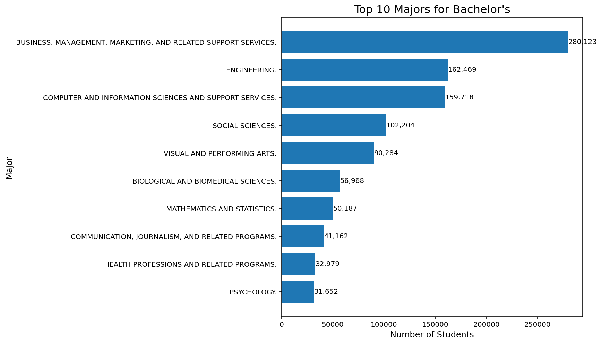
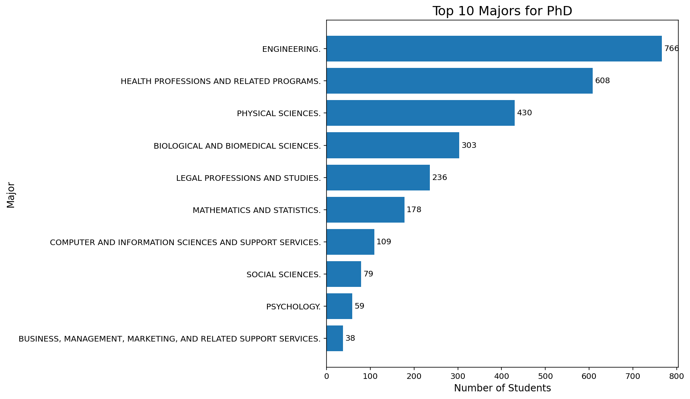
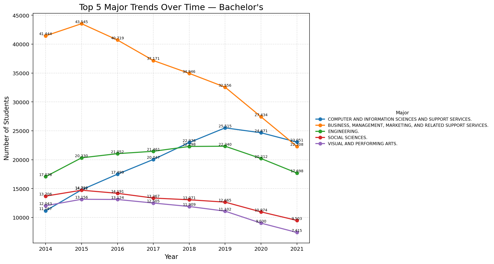
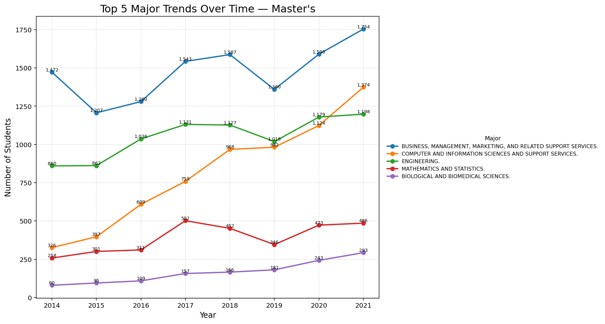
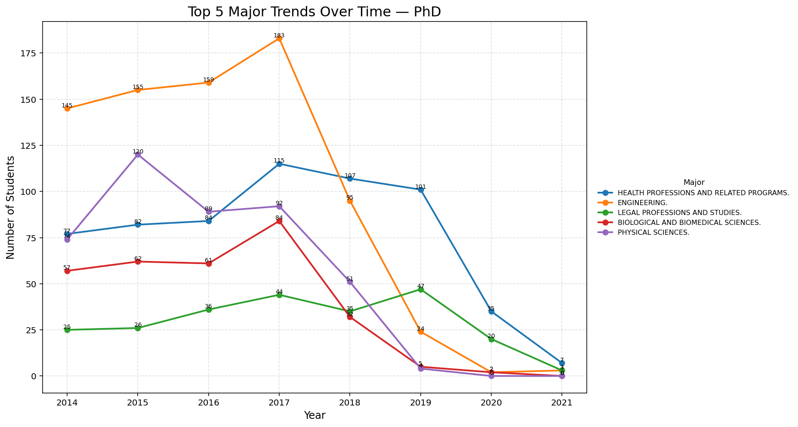
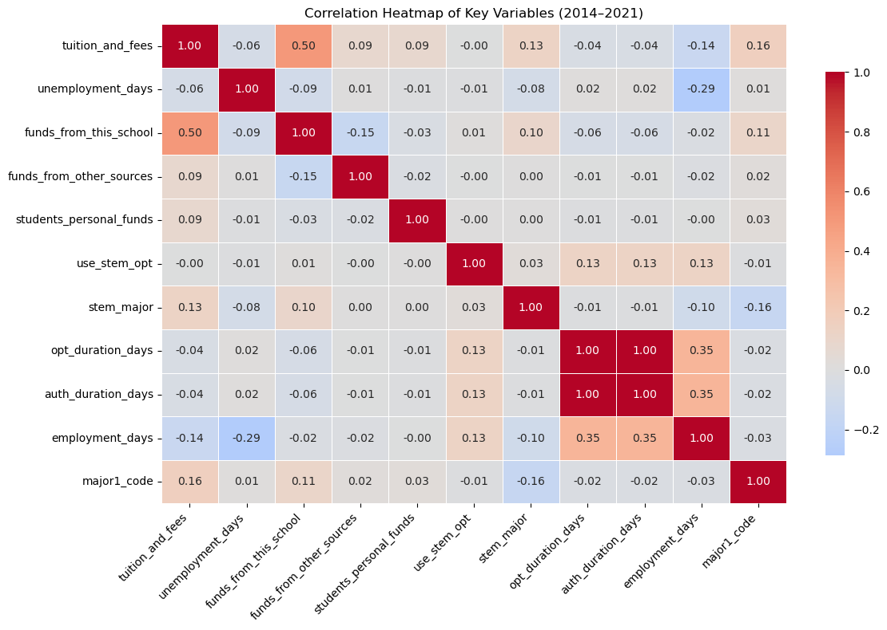
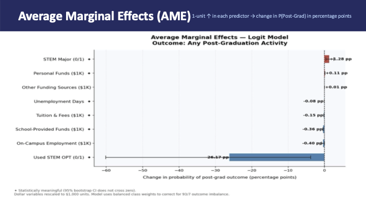
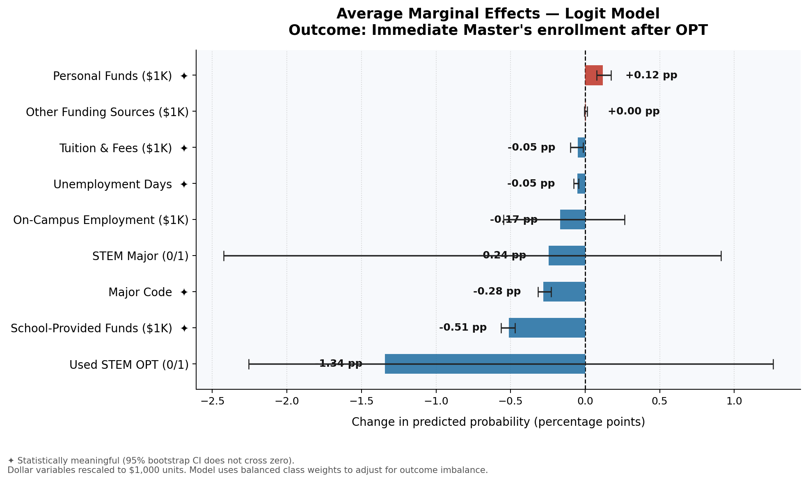

# Structural Pathways to Further Education Among F-1 Students

## Abstract
This study analyzes how institutional, financial, geographic, and OPT factors shape F-1 students’ progression to further education using SEVIS data. Findings show OPT participation and STEM status strongly increase advancement, while high tuition and unemployment reduce progression. 

## Introduction
F-1 students play a major role in U.S. higher education, but their educational pathways are constrained by immigration rules and unequal access to resources. This project asks how structural factors (not just merit) determine who progresses among international students. 

## Data Sources
The analysis uses SEVIS administrative data from the U.S. Immigration and Customs Enforcement (ICE) FOIA Library, covering student academic, financial, geographic, and employment records. 

## Data Retrieval / Tractable Data
SEVIS data is highly tractable due to its large scale (~50M records) and integration of multiple dimensions, processed through cleaning, deduplication, and feature engineering into an analysis-ready dataset. 

## EDA
### Stem vs. Non-Stem

### Potential pathways

### Top majors for degree levels

### Majors over time over degree levels

## Methodology
A logistic regression model is used to estimate how key factors influence progression onto further education and immediate job outcomes .The outcome variable is defined as a binary category.

## Results (Model & Key Relationships)

### Correlation Heatmap

The correlation heatmap shows no severe multicollinearity, with only moderate relationships (e.g., STEM status and authorization duration), supporting model stability. 

## Logistic Regression Results
### Model 1: Any further education outcomes

### Model 2: Post-OPT decisions (Master's, Ph.D's, Jobs)

## Stakeholder Implications
Universities, policymakers, and employers can improve outcomes by expanding OPT access, reducing administrative barriers, and strengthening institutional and employer support systems. 

## Ethical, Legal, Societal Implications
The findings highlight fairness concerns as progression depends on structured opportunities, legal systems act as gatekeepers of access, and disruptions to international student flows have significant economic consequences. 