```{r xaringan-themer, include=FALSE, warning=FALSE}
library(xaringanthemer)

style_mono_accent(
  base_color = "#003366",        # deep academic navy
  text_bold_color = "#003366",   # bold text same navy (clean look)
  link_color = "#1f4e79",        # softer navy for links
  
  header_font_google = google_font("Open Sans"),
  text_font_google   = google_font("Lato"),
  code_font_google   = google_font("Fira Code"),
  
  header_h1_font_size = "2.5rem",
  header_h2_font_size = "1.9rem",
  header_h3_font_size = "1.4rem",
  text_font_size = "1.15rem",
  
  padding = "0px 64px 16px 64px",
  header_background_padding = "4rem"
)
```
```{css, echo=FALSE}
.title-slide {
  background-image: url('background.png');
  background-size: cover;
  background-position: center;
  background-repeat: no-repeat;
}

.title-slide::before {
  content: '';
  position: absolute;
  inset: 0;
  background: rgba(0, 30, 80, 0.55);
  z-index: 0;
}

.title-slide h1,
.title-slide h2,
.title-slide h3,
.title-slide p {
  position: relative;
  z-index: 1;
  color: #ffffff;
}
```

# Motivation
.pull-left[International students on F-1 visas play a vital role in U.S. higher education, yet their progression to further education is shaped by uneven institutional, financial, and geographic conditions. While prior research has focused on enrollment and visa policy, there is limited empirical evidence on how these structural factors influence continued educational attainment.

This study examines how school characteristics, funding, location, and participation in Optional Practical Training (OPT) are associated with progression to further education. Using student-level SEVIS data, the analysis combines descriptive statistics with regression methods to identify patterns across institutions and student groups.
]

.pull-right[<center>

</center>]


---
# Data Challenges
- Highly Fragmented Data Structure:
The dataset is distributed across multiple folders (13 total), each containing 4–7 separate files, requiring consolidation before analysis.

- Large-Scale Data Volume:
Each file contains millions of rows, introducing computational and performance challenges during processing and transformation.

- Duplicate Individual Identifiers:
Repeated records for the same individual required careful deduplication and validation to ensure consistency across observations.

- Inconsistent and Messy Data Formats:
Variations in formatting, missing values, and irregular entries required extensive cleaning and standardization.

- Alignment of Academic Fields (CIP Codes):
Majors needed to be mapped and standardized using CIP codes to enable consistent grouping and comparison across records.

---
# Data Retrival & Tractability

<div style="display: flex; justify-content: center; align-items: center; height: 78vh;">
  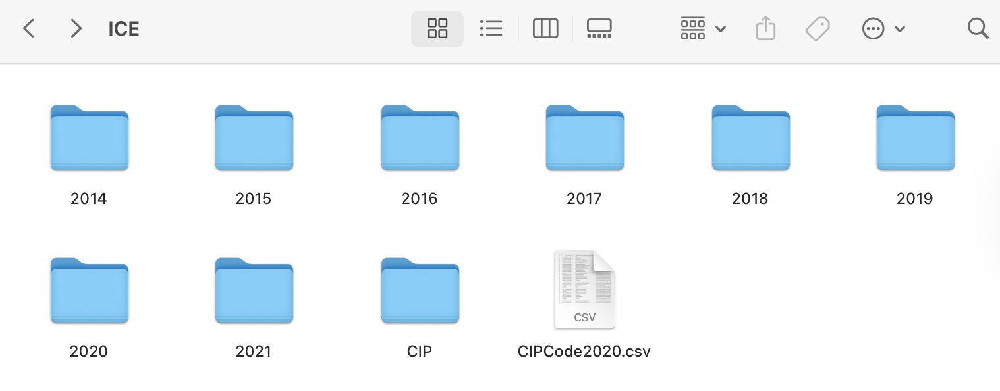
</div>
---
# Data Retrival & Tractability

<div style="display: flex; justify-content: center; align-items: center; height: 78vh;">
  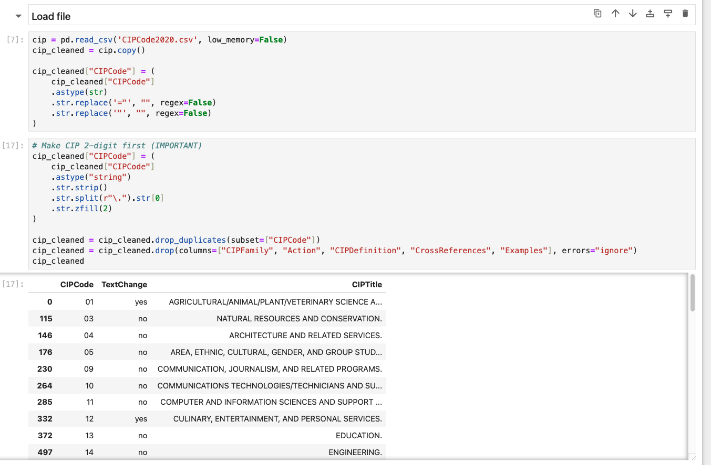
</div>

---
# Data Retrival & Tractability

<div style="display: flex; justify-content: center; align-items: center; height: 78vh;">
  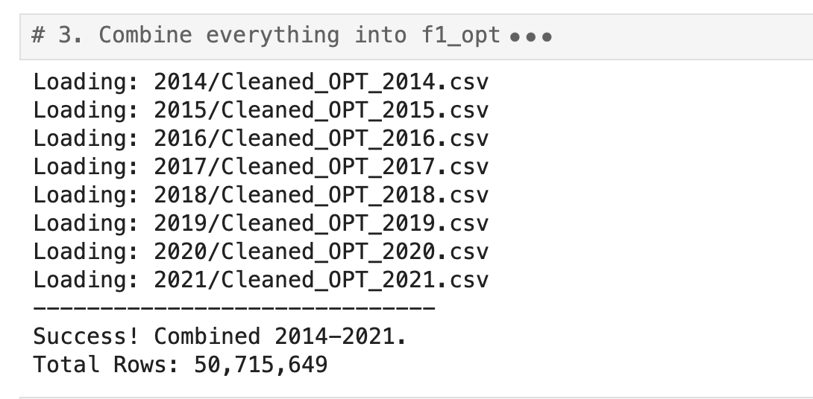
</div>

---
class: center, middle
# Countries of Origin Map
```{r world_students_map, echo=FALSE, message=FALSE, warning=FALSE, fig.width=14, fig.height=8, out.width="100%", fig.align="center"}

library(dplyr)
library(tidyr)
library(plotly)
library(arrow)
library(stringr)
library(purrr)
library(scales)
library(ggplot2)   # for map_data()

# ---- FILE PATHS ---- ###### Professor may need to change these filepaths; the files are also in this folder
file_paths <- list.files(
  path = dirname(rstudioapi::getSourceEditorContext()$path),
  pattern = "Cleaned_OPT_.*\\.parquet$",
  full.names = TRUE
)

# ---- READ + COMBINE ----
df <- map_dfr(file_paths, function(path) {
  year <- str_extract(path, "\\d{4}") %>% as.integer()
  read_parquet(path, col_select = "country_of_citizenship") %>%
    mutate(year = year)
})

# ---- AGGREGATE ----
country_year_counts <- df %>%
  drop_na(country_of_citizenship) %>%
  mutate(
    country_of_citizenship = country_of_citizenship %>%
      str_trim() %>%
      str_to_title()
  ) %>%
  count(year, country_of_citizenship, name = "student_count")

# ---- WIDE FORMAT ----
years <- sort(unique(country_year_counts$year))
wide_counts <- country_year_counts %>%
  pivot_wider(
    names_from  = year,
    values_from = student_count,
    values_fill = 0
  )

# ---- LOG SCALE ----
log_col <- function(x) log1p(x)
global_max_log <- log_col(max(unlist(wide_counts[, as.character(years)]), na.rm = TRUE))

# ---- EXPANDED YELLOW → ORANGE → RED COLORSCALE (9 stops) ----
colorscale <- list(
  list(0.00,  "#ffffcc"),   # near-zero: pale yellow
  list(0.10,  "#ffeda0"),   # very low
  list(0.22,  "#fed976"),   # low
  list(0.35,  "#feb24c"),   # low-mid: warm yellow-orange
  list(0.48,  "#fd8d3c"),   # mid: orange
  list(0.60,  "#fc4e2a"),   # mid-high: orange-red
  list(0.72,  "#e31a1c"),   # high: red
  list(0.85,  "#bd0026"),   # very high: deep red
  list(1.00,  "#800026")    # max: dark crimson
)

# ---- COLORBAR TICKS (real numbers on log axis) ----
tick_raw    <- c(1, 5, 20, 100, 500, 2000, 10000, 50000, 200000)
tick_log    <- log_col(tick_raw)
tick_labels <- c("1", "5", "20", "100", "500", "2K", "10K", "50K", "200K")

# ---- COUNTRY CENTROIDS for name labels ----
country_coords <- map_data("world") %>%
  group_by(region) %>%
  summarise(lon = mean(long), lat = mean(lat), .groups = "drop") %>%
  rename(country_of_citizenship = region) %>%
  mutate(country_of_citizenship = str_to_title(country_of_citizenship))

label_data <- wide_counts %>%
  inner_join(country_coords, by = "country_of_citizenship")

# ---- HOVER TEXT (stats only on hover) ----
make_hover <- function(counts, yr) {
  paste0(
    "<b>", wide_counts$country_of_citizenship, "</b>",
    "<br>Year: ", yr,
    "<br>Students: ", comma(counts)
  )
}

first_year  <- years[1]
first_z_raw <- wide_counts[[as.character(first_year)]]
first_z_log <- log_col(first_z_raw)

# ---- YEAR BUTTONS ----
buttons <- lapply(years, function(yr) {
  z_raw <- wide_counts[[as.character(yr)]]
  z_log <- log_col(z_raw)
  hover <- make_hover(z_raw, yr)

  list(
    label  = as.character(yr),
    method = "restyle",
    args   = list(
      list(
        z    = list(z_log),
        text = list(hover)
      ),
      list(0)   # only update trace 0 (choropleth)
    )
  )
})

# ---- BUILD PLOT ----
p <- plot_ly() %>%

  # --- Choropleth layer ---
  add_trace(
    type          = "choropleth",
    locations     = wide_counts$country_of_citizenship,
    locationmode  = "country names",
    z             = first_z_log,
    text          = make_hover(first_z_raw, first_year),
    hovertemplate = "%{text}<extra></extra>",
    colorscale    = colorscale,
    zmin          = 0,
    zmax          = global_max_log,
    colorbar      = list(
      title     = list(text = "Students", side = "right"),
      tickvals  = tick_log,
      ticktext  = tick_labels,
      thickness = 15,
      len       = 0.65
    ),
    showscale = TRUE
  ) %>%

  # --- Country name labels ONLY (no stats, no hover) ---
  add_trace(
    type      = "scattergeo",
    lon       = label_data$lon,
    lat       = label_data$lat,
    text      = label_data$country_of_citizenship,   # name only
    mode      = "text",
    textfont  = list(size = 7, color = "#222222"),
    hoverinfo = "none",    # completely suppress hover on this trace
    showlegend = FALSE
  ) %>%

  layout(
    title = list(
      text = paste0(
        "<b>International Students on OPT by Country of Citizenship</b><br>",
        "<sup>Log color scale · hover for details · select year below</sup>"
      ),
      x    = 0.5,
      font = list(size = 18)
    ),
    geo = list(
      projection     = list(type = "natural earth"),
      showframe      = FALSE,
      showcoastlines = TRUE,
      coastlinecolor = "#aaaaaa",
      showland       = TRUE,
      landcolor      = "#f9f9f9",
      showocean      = TRUE,
      oceancolor     = "#ddeeff",
      showcountries  = TRUE,
      countrycolor   = "#cccccc"
    ),
    margin = list(l = 0, r = 0, t = 100, b = 120),

    updatemenus = list(list(
      type        = "buttons",
      direction   = "right",
      x           = 0.5,
      xanchor     = "center",
      y           = -0.08,
      yanchor     = "top",
      buttons     = buttons,
      font        = list(size = 13),
      bgcolor     = "#f7f7f7",
      bordercolor = "#cccccc",
      borderwidth = 1
    ))
  )

p
```
---
<div style="display: flex; justify-content: center; align-items: center; height: 90vh;">
  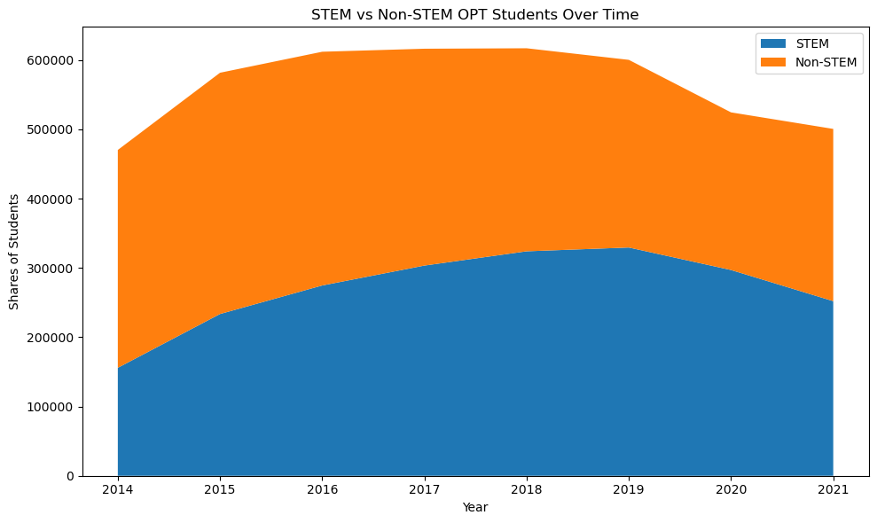
</div>
---
<div style="display: flex; justify-content: center; align-items: center; height: 90vh;">
  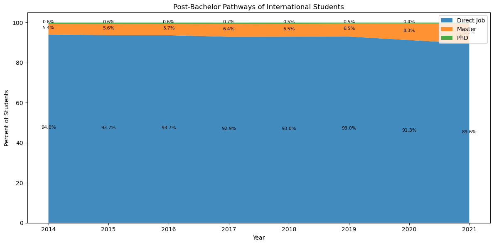
</div>
---

# Top Majors for Degree Levels
<div style="display: grid; grid-template-rows: 1fr 1fr; gap: 5px; height: 75vh;">
  
  <div style="display: grid; grid-template-columns: 1fr 1fr; gap: 5px;">
    
    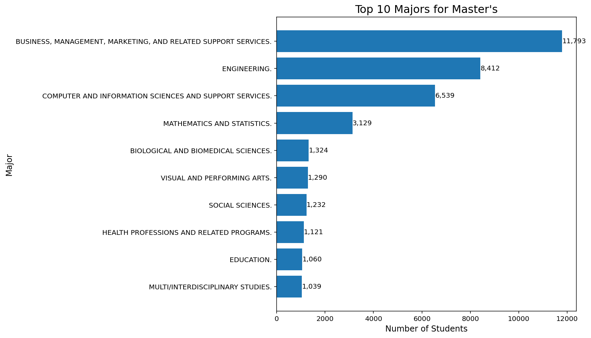
  </div>

  <div style="display: flex; justify-content: center;">
    
  </div>

</div>
---

# Top Majors for Degree Levels over Time
<div style="display: grid; grid-template-rows: 1fr 1fr; gap: 5px; height: 75vh;">
  
  <div style="display: grid; grid-template-columns: 1fr 1fr; gap: 5px;">
    
    
  </div>

  <div style="display: flex; justify-content: center;">
    
  </div>

</div>
---
# Correlation Heatmap

<div style="display: flex; justify-content: center; align-items: center; height: 78vh;">
  
</div>

---
class: inverse, middle
background-color: "#202766"

# Model 1 

.right[
### Outcome: Any Post-Graduation Activity
]
---

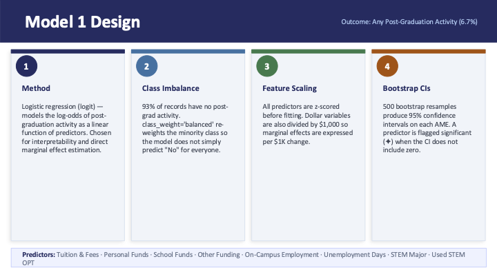

---

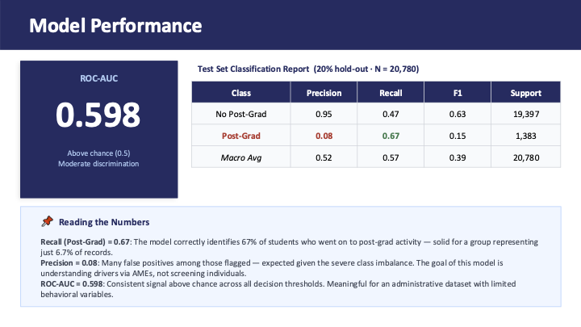

---
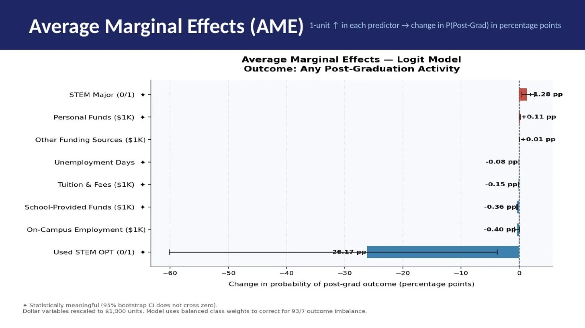

---
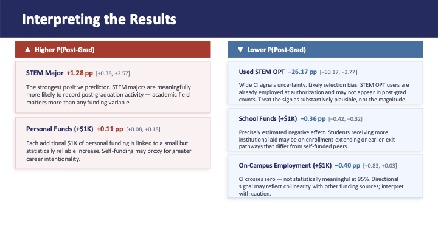

---
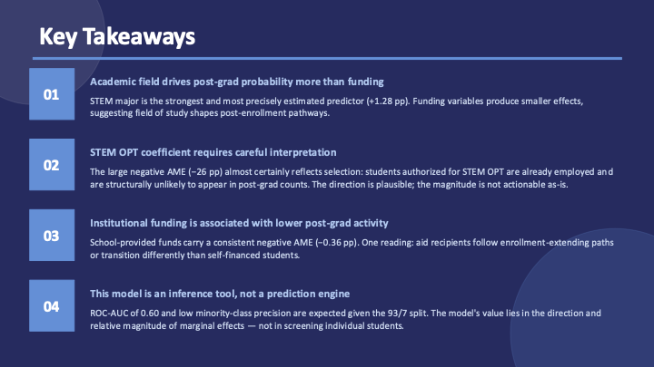

---
class: inverse, middle
background-color: "#202766"

# Model 2 

.right[
### Outcome: Post-OPT Decision
]

---
<style>
.model-header {
  background-color: #202766;
  color: white;
  padding: 28px 45px;
  margin: -40px -60px 25px -60px;
  display: flex;
  justify-content: space-between;
  align-items: center;
}

.model-title {
  font-size: 44px;
  font-weight: 800;
}

.model-outcome {
  font-size: 20px;
  color: #cfd6ee;
  font-weight: 600;
}

.card-row {
  display: flex;
  gap: 20px;
  margin-top: 20px;
}

.model-card {
  background-color: #e7ebf2;
  width: 24%;
  min-height: 470px;
  border: 1px solid #d0d6e0;
  box-shadow: 0px 3px 8px rgba(0,0,0,0.08);
  position: relative;
}

.card-bar {
  height: 12px;
}

.circle {
  width: 58px;
  height: 58px;
  border-radius: 50%;
  color: white;
  font-size: 28px;
  font-weight: 800;
  display: flex;
  justify-content: center;
  align-items: center;
  margin: 18px 0 0 22px;
}

.card-content {
  padding: 18px 28px;
}

.card-title {
  color: #202766;
  font-size: 24px;
  font-weight: 800;
  margin-bottom: 18px;
}

.card-text {
  font-size: 18px;
  line-height: 1.45;
  color: #333333;
}

.predictor-box {
  margin-top: 28px;
  padding: 14px 22px;
  background-color: #eef1fb;
  border: 2px solid #cfd6ee;
  font-size: 17px;
  color: #333333;
}

.predictor-box b {
  color: #202766;
}
</style>

<div class="model-header">
  <div class="model-title">Model 2 Design</div>
  <div class="model-outcome">Outcome: Immediate Post-OPT Decision</div>
</div>

<div class="card-row">

<div class="model-card">
<div class="card-bar" style="background:#202766;"></div>
<div class="circle" style="background:#202766;">1</div>
<div class="card-content">
<div class="card-title">Method</div>
<div class="card-text">
Separate binary logistic regressions estimate three post-OPT pathways: imm_master, imm_phd, imm_job.
</div>
</div>
</div>

<div class="model-card">
<div class="card-bar" style="background:#2b7bbb;"></div>
<div class="circle" style="background:#2b7bbb;">2</div>
<div class="card-content">
<div class="card-title">Expanded Predictors</div>
<div class="card-text">
Model 2 adds major-level controls through numeric major codes. This captures variation across academic fields while controlling for funding, unemployment, STEM participation, and employment characteristics.
</div>
</div>
</div>

<div class="model-card">
<div class="card-bar" style="background:#15803d;"></div>
<div class="circle" style="background:#15803d;">3</div>
<div class="card-content">
<div class="card-title">Scaling & Imbalance</div>
<div class="card-text">
All predictors are z-scored before estimation. Dollar variables are divided by $1,000 for interpretable marginal effects. Balanced class weights adjust for uneven outcome shares.
</div>
</div>
</div>

<div class="model-card">
<div class="card-bar" style="background:#c75b12;"></div>
<div class="circle" style="background:#c75b12;">4</div>
<div class="card-content">
<div class="card-title">Marginal Effects</div>
<div class="card-text">
Average marginal effects translate logit coefficients into percentage-point changes in predicted probabilities. 500 bootstrap resamples produce 95% confidence intervals.
</div>
</div>
</div>

</div>

<div class="predictor-box">
<b>Predictors:</b> Tuition & Fees · Personal Funds · School Funds · Other Funding · On-Campus Employment · Unemployment Days · STEM Major · Used STEM OPT · Major Code
</div>

---

# Model Performance

.pull-left[
.center[
### Direct Employment
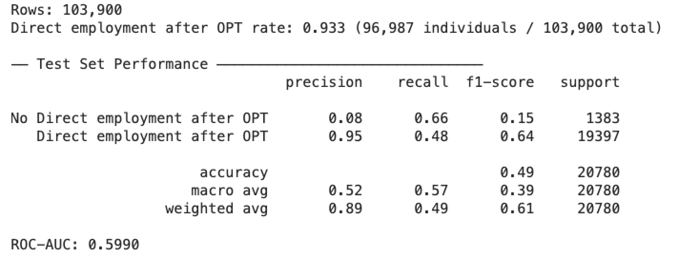

<small>
<b>Interpretation:</b>  
Higher recall suggests the model captures many students transitioning directly into employment, although low precision reflects severe class imbalance.
</small>
]
]

.pull-right[
.center[
### Immediate Master’s Enrollment
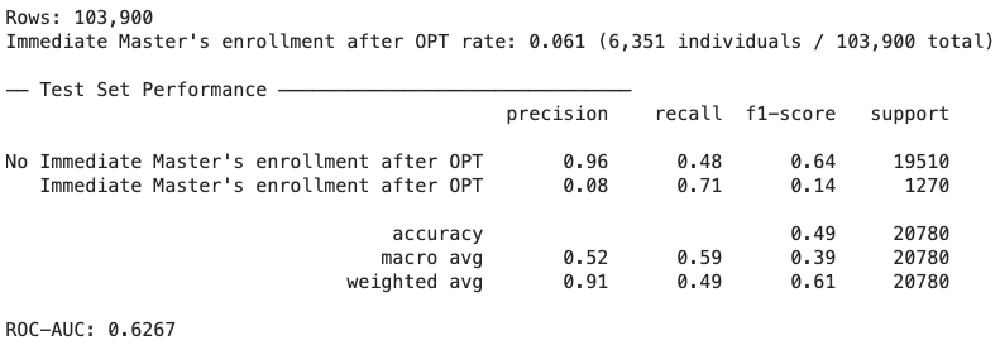

<small>
<b>Interpretation:</b>  
The Master’s model achieves the strongest recall across the three pathways, indicating better identification of students continuing directly into graduate study.
</small>
]
]

---

# Model Performance

.center[
### Immediate PhD Enrollment
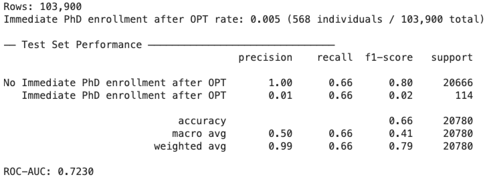


<small>
<b>Interpretation:</b>  
The PhD model has the highest ROC-AUC, suggesting the strongest discrimination performance, though precision remains extremely low because doctoral transitions are rare.
</small>
]

---
## Average Marginal Effects (AME): Employment Post-OPT

<style>
.phd-wrap{
display:flex;
gap:18px;
align-items:flex-start;
margin-top:10px;
}

.phd-box{
width:24%;
background:#eef2fb;
border-top:8px solid #202766;
padding:16px 18px;
box-shadow:0 2px 6px rgba(0,0,0,0.08);
}

.phd-title{
font-size:24px;
font-weight:800;
color:#202766;
margin-bottom:8px;
}

.phd-auc{
font-size:44px;
font-weight:800;
color:#111;
line-height:1;
margin-bottom:4px;
}

.phd-sub{
font-size:16px;
color:#444;
margin-bottom:14px;
}

.metric{
background:white;
padding:10px 12px;
margin-bottom:10px;
border-left:5px solid #202766;
}

.metric-label{
font-size:13px;
color:#666;
font-weight:700;
}

.metric-value{
font-size:28px;
font-weight:800;
color:#111;
}

.phd-points{
margin-top:10px;
font-size:15px;
line-height:1.45;
}

.phd-plot{
width:74%;
}
</style>

<div class="phd-wrap">

<div class="phd-box">

<div class="phd-title">Immediate Master</div>

<div class="phd-auc">0.599</div>
<div class="phd-sub">ROC-AUC</div>

<div class="metric">
<div class="metric-label">Recall</div>
<div class="metric-value">0.48</div>
</div>

<div class="metric">
<div class="metric-label">Precision</div>
<div class="metric-value">0.95</div>
</div>

<div class="phd-points">
<ul>
<li>Used STEM OPT is the strongest positive predictor of direct employment.</li>

<li>STEM majors are less likely to move directly into employment.</li>

<li>The model performs above random classification, though low precision reflects severe class imbalance.</li>
</ul>
</div>

</div>

<div class="phd-plot">

.right[
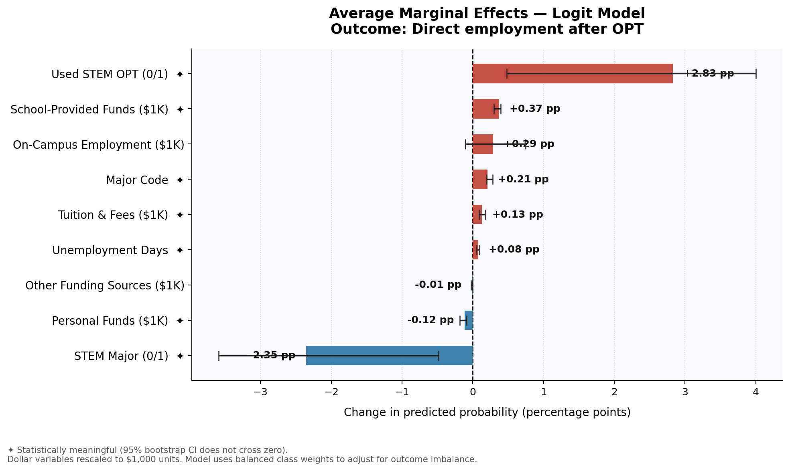
]

</div>

</div>

---
## Average Marginal Effects (AME): Master Post-OPT

<style>
.phd-wrap{
display:flex;
gap:18px;
align-items:flex-start;
margin-top:10px;
}

.phd-box{
width:24%;
background:#eef2fb;
border-top:8px solid #202766;
padding:16px 18px;
box-shadow:0 2px 6px rgba(0,0,0,0.08);
}

.phd-title{
font-size:24px;
font-weight:800;
color:#202766;
margin-bottom:8px;
}

.phd-auc{
font-size:44px;
font-weight:800;
color:#111;
line-height:1;
margin-bottom:4px;
}

.phd-sub{
font-size:16px;
color:#444;
margin-bottom:14px;
}

.metric{
background:white;
padding:10px 12px;
margin-bottom:10px;
border-left:5px solid #202766;
}

.metric-label{
font-size:13px;
color:#666;
font-weight:700;
}

.metric-value{
font-size:28px;
font-weight:800;
color:#111;
}

.phd-points{
margin-top:10px;
font-size:15px;
line-height:1.45;
}

.phd-plot{
width:74%;
}
</style>

<div class="phd-wrap">

<div class="phd-box">

<div class="phd-title">Immediate Master</div>

<div class="phd-auc">0.627</div>
<div class="phd-sub">ROC-AUC</div>

<div class="metric">
<div class="metric-label">Recall</div>
<div class="metric-value">0.71</div>
</div>

<div class="metric">
<div class="metric-label">Precision</div>
<div class="metric-value">0.08</div>
</div>

<div class="phd-points">
<ul>
<li>Best recall among the three pathways.</li>

<li>Suggests the model captures many students who continue directly into Master’s study.</li>

<li>Financial variables appear more important than STEM participation.</li>
</ul>
</div>

</div>

<div class="phd-plot">

.right[

]

</div>

</div>


---
## Average Marginal Effects (AME): PHD Post-OPT

<style>
.phd-wrap{
display:flex;
gap:18px;
align-items:flex-start;
margin-top:10px;
}

.phd-box{
width:24%;
background:#eef2fb;
border-top:8px solid #202766;
padding:16px 18px;
box-shadow:0 2px 6px rgba(0,0,0,0.08);
}

.phd-title{
font-size:24px;
font-weight:800;
color:#202766;
margin-bottom:8px;
}

.phd-auc{
font-size:44px;
font-weight:800;
color:#111;
line-height:1;
margin-bottom:4px;
}

.phd-sub{
font-size:16px;
color:#444;
margin-bottom:14px;
}

.metric{
background:white;
padding:10px 12px;
margin-bottom:10px;
border-left:5px solid #202766;
}

.metric-label{
font-size:13px;
color:#666;
font-weight:700;
}

.metric-value{
font-size:28px;
font-weight:800;
color:#111;
}

.phd-points{
margin-top:10px;
font-size:15px;
line-height:1.45;
}

.phd-plot{
width:74%;
}
</style>

<div class="phd-wrap">

<div class="phd-box">

<div class="phd-title">Immediate PhD</div>

<div class="phd-auc">0.723</div>
<div class="phd-sub">ROC-AUC</div>

<div class="metric">
<div class="metric-label">Recall</div>
<div class="metric-value">0.66</div>
</div>

<div class="metric">
<div class="metric-label">Precision</div>
<div class="metric-value">0.01</div>
</div>

<div class="phd-points">
<ul>
<li>Strongest discrimination performance.</li>

<li>STEM major dominates doctoral continuation.</li>

<li>Very low precision is expected because PhD transitions are extremely rare.</li>
</ul>
</div>

</div>

<div class="phd-plot">

.right[
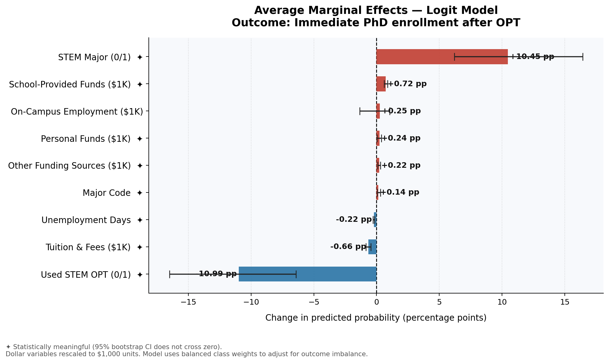
]

</div>

</div>


---


# Implications for Stakeholders


**Universities**
- Expand DSO capacity and employer partnerships, especially for non- STEM students who face shorter work authorization windows.

- Provide OPT application support (workshops, fee assistance), as administrative complexity can limit access.

**Policymakers**
- Recognize that OPT shapes educational progression, not just employment outcomes. Under U.S. Citizenship and Immigration Services rules, STEM students can receive up to 3 years of work authorization, compared to 1 year for non-STEM, creating unequal opportunity across fields.

- Reevaluate this 3-year vs. 1-year structure, as it may influence both major selection and access to further education.

- Reduce administrative and financial burdens (e.g., increased premium processing fees), which disproportionately affect students with fewer resources.

---
# Implications for Stakeholders
**Regional Economies & Employers**
- International students are a critical talent pipeline. According to NAFSA: Association of International Educators, declines in international enrollment can lead to billions in lost economic activity and thousands of jobs.

- Improve employer awareness of OPT hiring rules to reduce hesitation in hiring F-1 students.

- Strengthen regional university–employer partnerships, especially outside major metro areas, to expand access to OPT opportunities.
International Students

- Educational outcomes are shaped by policy and structure, not just academic performance.

- Choosing STEM-designated programs or institutions with strong employer networks can significantly expand post-graduation opportunities under current OPT rules.

---
# Ethical, Legal & Societal Implications

**Ethical Considerations**
-  While OPT participation has expanded, it now accounts for roughly 25% of all international students, indicating that access to post- graduation work pathways is becoming a central determinant of student outcomes rather than an optional extension.

- This raises ethical concerns about fairness, as students’ ability to continue their education depends on access to these structured pathways rather than equal academic standing.

**Legal Contribution**
- This project highlights how immigration policy directly shapes educational trajectories at scale. In 2025, F-1 visa issuance dropped by 36% compared to the previous year due to policy and administrative changes, demonstrating how regulatory shifts can immediately restrict access to U.S. education.

- Rather than acting as a neutral framework, the legal system functions as a gatekeeping mechanism, determining not only who enters but who is able to remain and progress within the system.

---
# Ethical, Legal & Societal Implications
.pull-left[**Societal Contribution**
- The analysis connects individual student outcomes to broader economic consequences. International students contributed approximately $43–46 billion annually to the U.S. economy and supported over 350,000–398,000 jobs in recent years.

- However, a 17% decline in new student enrollment in 2025 led to an estimated $1.1 billion loss and nearly 23,000 fewer jobs, showing that disruptions to international student pathways have immediate macroeconomic effects.
]

.pull-right[<center>

</center>]


---
# Limitations & Future Expansion

.pull-left[
### Limitations

- Data Scope: Analysis limited to 2014–2021; does not capture more recent trends
- Data Quality & Consistency: Missing values, duplicates, and inconsistent formatting may affect results
- Classification Constraints: Mapping majors to CIP codes may oversimplify fields of study
- Limited Outcome Visibility:Post-OPT outcomes may not fully capture long-term career paths
]

.pull-right[
### Future Expansion

- Extend Time Range: Include more recent data to capture post-2021 trends
- Deeper Policy Comparison: Further explore differences across policy periods (e.g., pre/post administration changes)
- Richer Outcome Analysis: Incorporate additional data sources to better track career trajectories
- Looking at students going to the U.S only for Master's or Ph.D's
- Looking at the job outcomes for extensively: Are students more likely to work in industries relating to their majors in college?
]

---


<div style="display: flex; flex-direction: column; justify-content: center; align-items: center; height: 90vh;">
  
  <p style="font-size: 2.5em; font-weight: bold; margin-top: 20px;">Thank You !!!</p>
</div>


