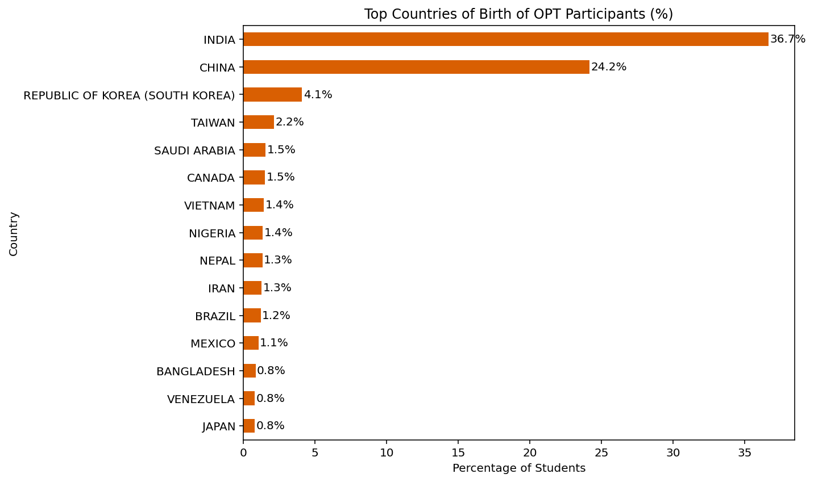
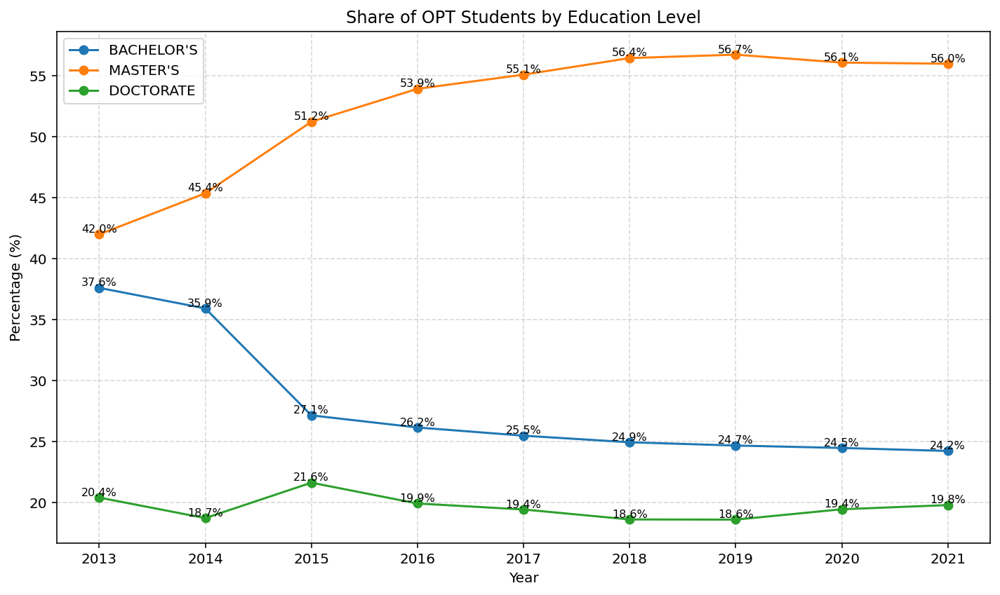
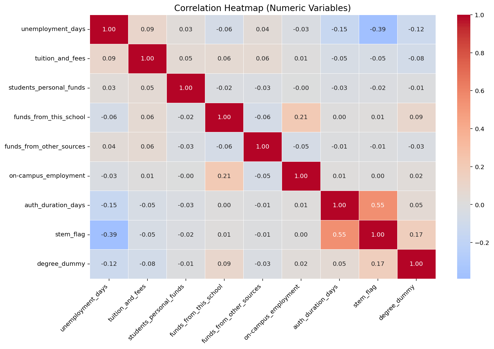
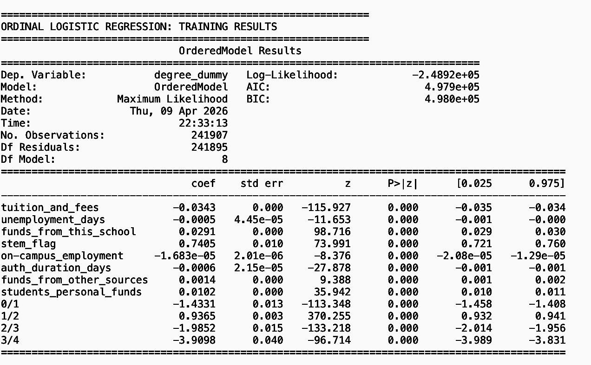
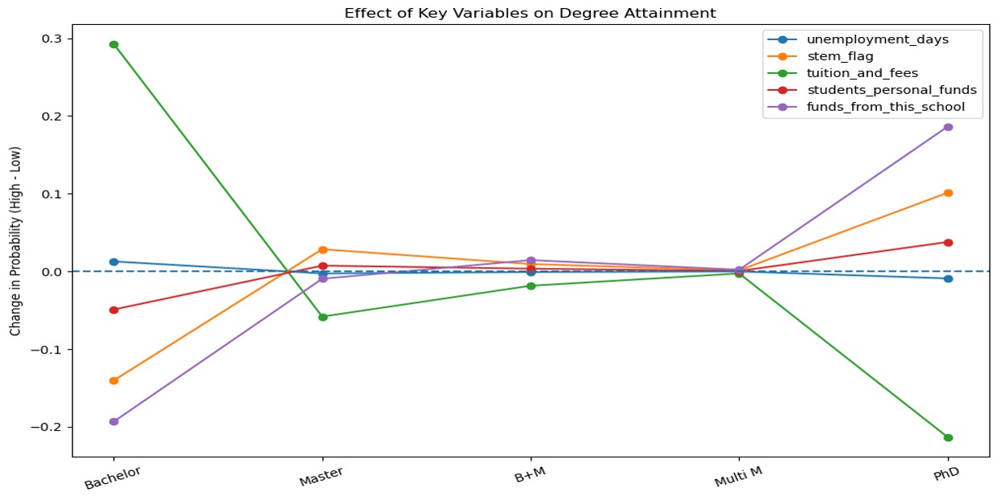

# Structural Pathways to Further Education Among F-1 Students

## Abstract
This study analyzes how institutional, financial, geographic, and OPT factors shape F-1 students’ progression to further education using SEVIS data. Findings show OPT participation and STEM status strongly increase advancement, while high tuition and unemployment reduce progression. 

## Introduction
F-1 students play a major role in U.S. higher education, but their educational pathways are constrained by immigration rules and unequal access to resources. This project asks how structural factors (not just merit) determine who progresses among international students. 

## Data Sources
The analysis uses SEVIS administrative data from the U.S. Immigration and Customs Enforcement (ICE) FOIA Library, covering student academic, financial, geographic, and employment records. 

## Data Retrieval / Tractable Data
SEVIS data is highly tractable due to its large scale (~50M records) and integration of multiple dimensions, processed through cleaning, deduplication, and feature engineering into an analysis-ready dataset. 

## EDA
Exploratory analysis includes three key visualizations: country concentration of OPT participants, trends in master’s participation over time, and growth patterns between STEM and non-STEM fields. 
### OPT Participants Are Concentrated in a Few Countries

### Master’s Students Dominate OPT Participation Over Time

### Growth in OPT Is Driven by Non-STEM Fields

## Methodology
An ordinal logistic regression model is used to estimate how key factors influence progression across ordered education levels from bachelor’s to PhD.The outcome variable is defined as an ordered category (0 = Bachelor’s only, 1 = Master’s only, 2 = Bachelor’s + one Master’s, 3 = more than one Master’s, 4 = PhD).

## Results (Model & Key Relationships)

### Correlation Heatmap

The correlation heatmap shows no severe multicollinearity, with only moderate relationships (e.g., STEM status and authorization duration), supporting model stability. 

### Ordinal Logistic Regression Results

The ordinal logistic regression results indicate that STEM status is the strongest positive predictor of progression, while higher tuition, unemployment days, and longer authorization duration reduce the likelihood of advancing. 

### Coefficient Plot

The coefficient plot reinforces these findings visually: STEM status and institutional funding increase the probability of progressing to higher degrees (especially PhD), while high tuition costs strongly reduce it.

## Stakeholder Implications
Universities, policymakers, and employers can improve outcomes by expanding OPT access, reducing administrative barriers, and strengthening institutional and employer support systems. 

## Ethical, Legal, Societal Implications
The findings highlight fairness concerns as progression depends on structured opportunities, legal systems act as gatekeepers of access, and disruptions to international student flows have significant economic consequences. 