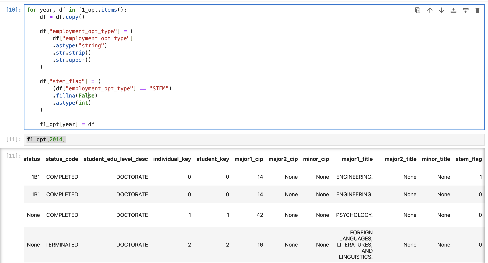
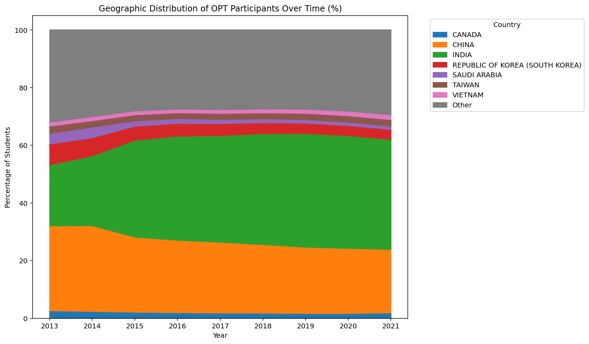
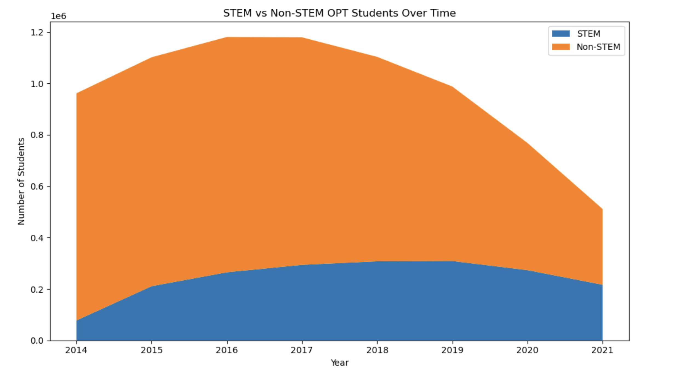
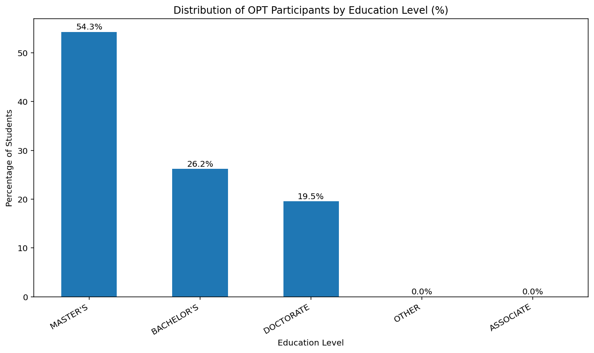

```{r xaringan-themer, include=FALSE, warning=FALSE}
library(xaringanthemer)

style_mono_accent(
  base_color = "#003366",        # deep academic navy
  text_bold_color = "#003366",   # bold text same navy (clean look)
  link_color = "#1f4e79",        # softer navy for links
  
  header_font_google = google_font("Open Sans"),
  text_font_google   = google_font("Lato"),
  code_font_google   = google_font("Fira Code"),
  
  header_h1_font_size = "2.5rem",
  header_h2_font_size = "1.9rem",
  header_h3_font_size = "1.4rem",
  text_font_size = "1.15rem",
  
  padding = "0px 64px 16px 64px",
  header_background_padding = "4rem"
)
```

# Motivation
.pull-left[This project explores the structure of the OPT population by examining how participants are distributed across geography, academic backgrounds, and post-OPT outcomes. 

The goal is to uncover patterns in how OPT is utilized: where participants are located, what they study, and how their trajectories evolve after completion. Through this exploration, the analysis aims to reveal relationships and trends that may not be immediately visible in aggregate statistics.

The analysis focuses on data from 2013 to 2021, allowing for an exploratory comparison across different policy environments, including the Obama and Trump administrations, to observe whether broader shifts may be reflected in the data.
]

.pull-right[<center>

</center>]


---
# Data Challenges
- Highly Fragmented Data Structure:
The dataset is distributed across multiple folders (13 total), each containing 4–7 separate files, requiring consolidation before analysis.

- Large-Scale Data Volume:
Each file contains millions of rows, introducing computational and performance challenges during processing and transformation.

- Duplicate Individual Identifiers:
Repeated records for the same individual required careful deduplication and validation to ensure consistency across observations.

- Inconsistent and Messy Data Formats:
Variations in formatting, missing values, and irregular entries required extensive cleaning and standardization.

- Alignment of Academic Fields (CIP Codes):
Majors needed to be mapped and standardized using CIP codes to enable consistent grouping and comparison across records.

---
# Data Retrival  
- Retrieved 13 FOIA Library datasets (ICE F-1 / OPT)
- Organized into yearly folders (2014–2021)

 
---
After combining files


---
Merge Major CIP code
{width=50%}
---
Stem flag


---
# Data Tractability
 <center>
 
</center>

---


---
{width=60%}

---
{width=60%}

---
# Implications for Stakeholders


**Universities & Academic Programs:**
- Understanding which majors are most represented in OPT may help institutions evaluate how academic programs align with post-graduation work opportunities.

**Employers & Recruiters:**
- Geographic and field-of-study patterns could provide insight into where OPT talent is concentrated and how firms might better target recruitment efforts.

**Policy & Immigration Stakeholders:**
- Observing how OPT is utilized—and what outcomes follow—may offer a clearer picture of how the program functions in practice across different groups.

**Students & Future OPT Participants:**
- Trends in outcomes and OPT usage may help inform expectations around career pathways after graduation.

---
# Ethical, Legal & Societal Implications

**Ethical Considerations**
- Protect individual privacy (no identification of individuals)
- Cleaning and classification choices may affect results
- Avoid overgeneralizing patterns in the data

**Legal & Institutional Dynamics**
- Follow data privacy laws and data-use agreements
- Limit sharing of sensitive or government-linked data
- Ensure secure storage and access

**Societal Distribution**
- Results may shape views on international students and OPT
- Data gaps may underrepresent certain groups
- Insights may influence education-to-career expectations


---
# Limitations & Future Expansion

.pull-left[
### Limitations

- Data Scope: Analysis limited to 2013–2021; does not capture more recent trends
- Data Quality & Consistency: Missing values, duplicates, and inconsistent formatting may affect results
- Classification Constraints: Mapping majors to CIP codes may oversimplify fields of study
- Limited Outcome Visibility:Post-OPT outcomes may not fully capture long-term career paths
]

.pull-right[
### Future Expansion

- Extend Time Range: Include more recent data to capture post-2021 trends
- Deeper Policy Comparison: Further explore differences across policy periods (e.g., pre/post administration changes)
- Richer Outcome Analysis: Incorporate additional data sources to better track career trajectories
- Improved Data Standardization: Refine cleaning and classification methods for greater consistency
]

---

class: center, middle

# Thank you!


