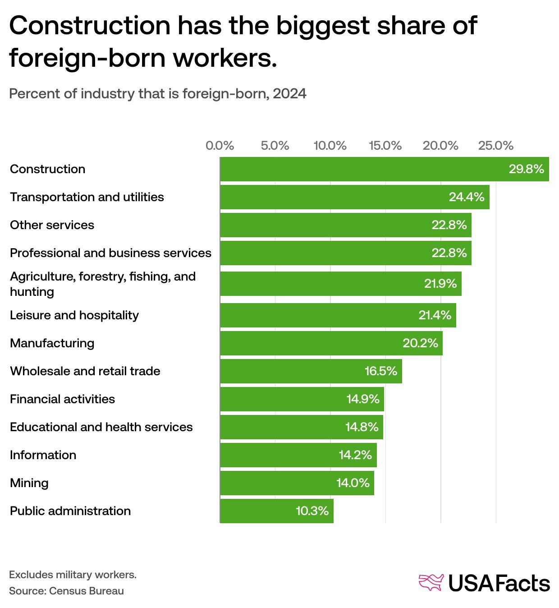
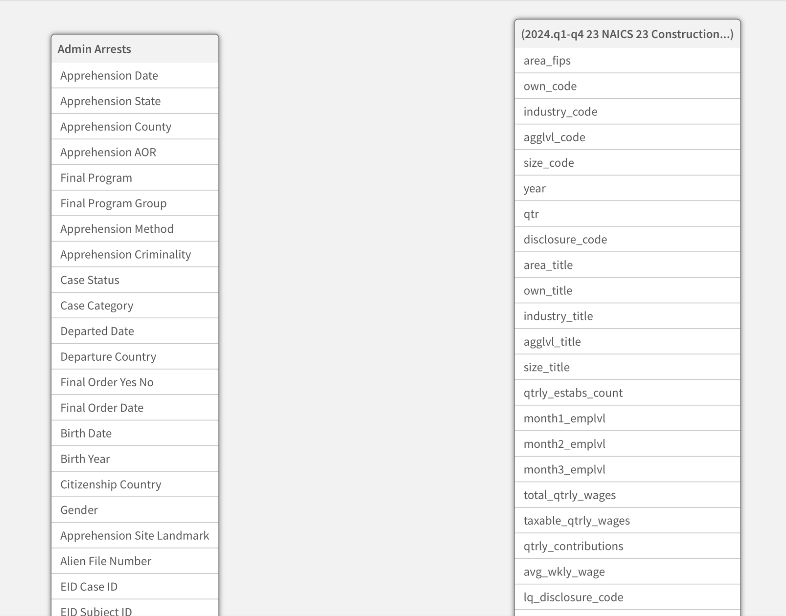
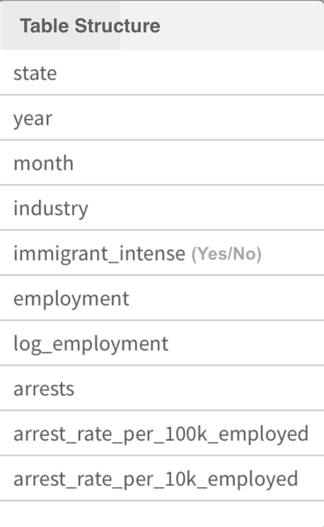
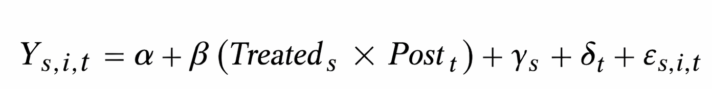
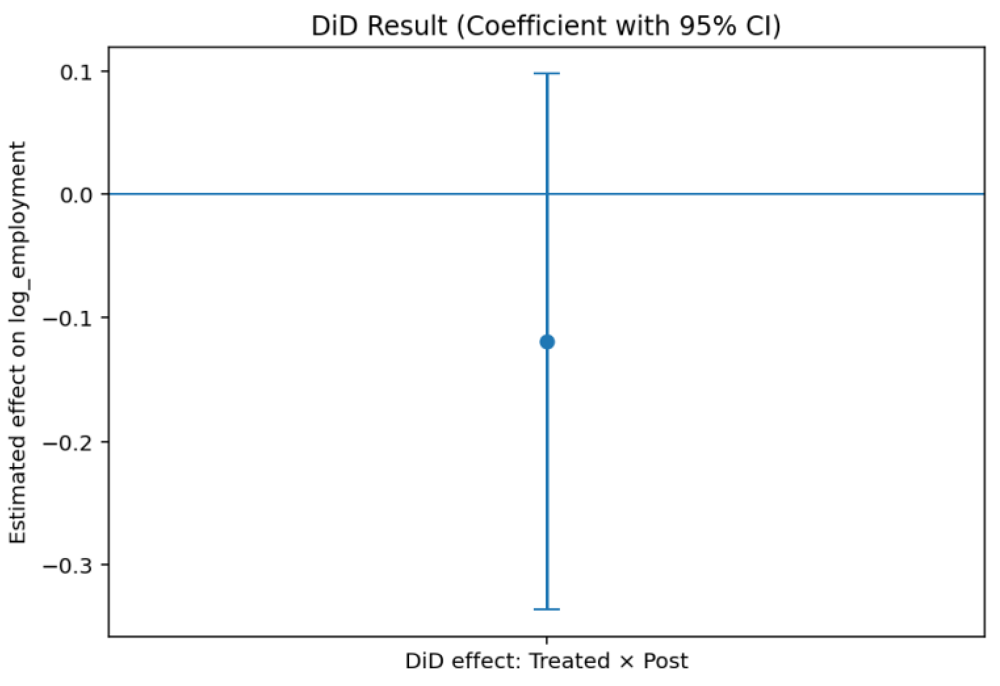
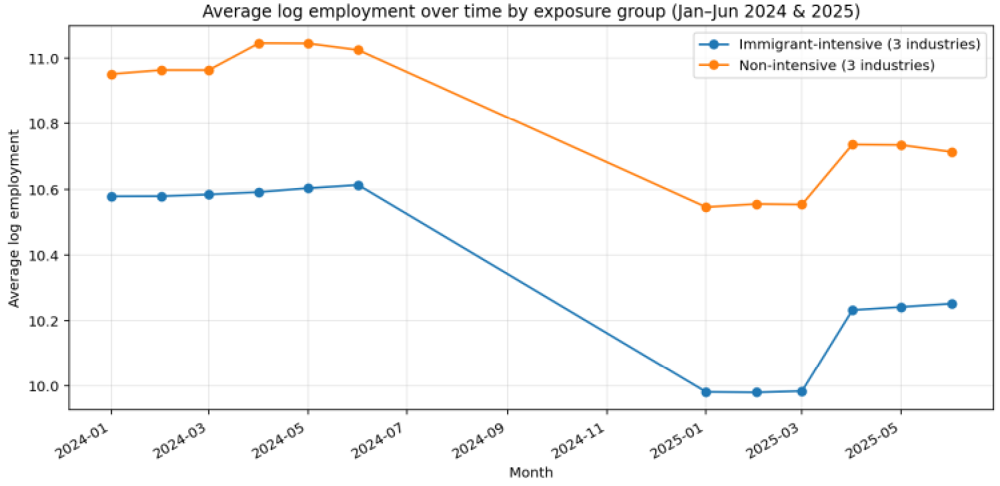
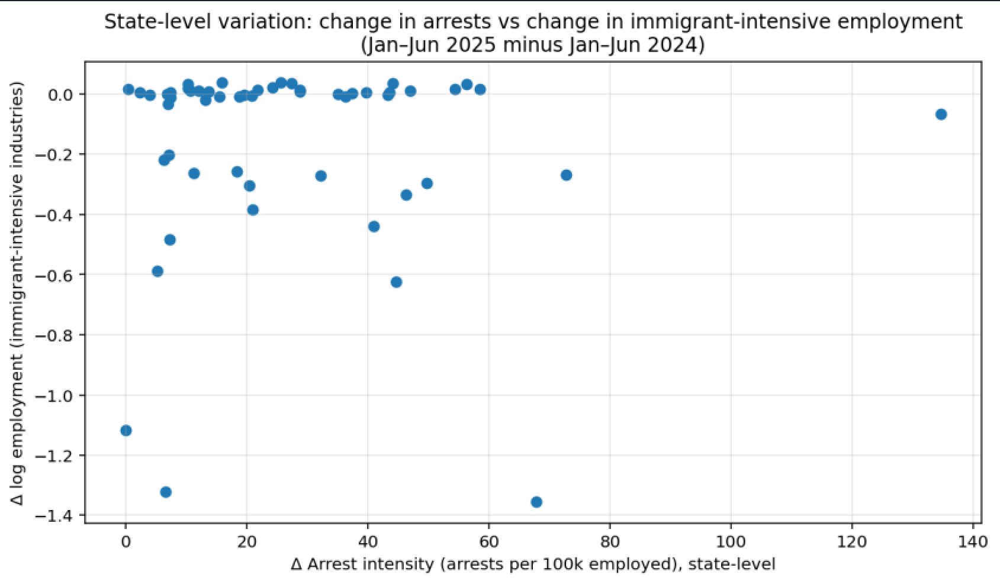

```{r xaringan-themer, include=FALSE, warning=FALSE}
library(xaringanthemer)

style_mono_accent(
  base_color = "#003366",        # deep academic navy
  text_bold_color = "#003366",   # bold text same navy (clean look)
  link_color = "#1f4e79",        # softer navy for links
  
  header_font_google = google_font("Open Sans"),
  text_font_google   = google_font("Lato"),
  code_font_google   = google_font("Fira Code"),
  
  header_h1_font_size = "2.5rem",
  header_h2_font_size = "1.9rem",
  header_h3_font_size = "1.4rem",
  text_font_size = "1.15rem",
  
  padding = "0px 64px 16px 64px",
  header_background_padding = "4rem"
)
```

# Motivation
.pull-left[In January 2025, the federal administration under President Trump signaled a renewed emphasis on interior immigration enforcement and deportation operations.


Policy shifts at the federal level may affect:
- ICE enforcement intensity,
- Labor market participation of immigrant workers,
- Employment outcomes in sectors that rely heavily on immigrant labor.


Industries differ significantly in their exposure to immigrant labor supply.


Different States also differ significantly in the level of ICE presence/enforcement.
]

--
.pull-right[<center>

</center>]


---
class: center, middle
# ICE Heatmap
```{r arrests_map_2025, echo=FALSE, message=FALSE, warning=FALSE, fig.width=14, fig.height=8, out.width="100%", fig.align="center"}


library(readxl)
library(dplyr)
library(tidyr)
library(plotly)

# ---- READ + AGGREGATE (2025) ----
df <- read_xlsx("Arrests_Edited_With_Year.xlsx") %>%
  filter(`Apprehension Year` == 2025) %>%
  mutate(
    state_upper = toupper(`Apprehension State`),
    Gender = trimws(tolower(Gender))
  )

state_lookup <- tibble(
  state_upper = toupper(state.name),
  state_abb   = state.abb,
  state_full  = state.name
)

counts_2025 <- df %>%
  group_by(state_upper) %>%
  summarise(
    total  = n(),
    female = sum(Gender == "female", na.rm = TRUE),
    male   = sum(Gender == "male",   na.rm = TRUE),
    .groups = "drop"
  ) %>%
  left_join(state_lookup, by = "state_upper") %>%
  filter(!is.na(state_abb)) %>%
  select(state_full, state_abb, total, female, male)

# Ensure all states appear (0 if missing)
all_states <- tibble(state_full = state.name, state_abb = state.abb)

counts_2025 <- all_states %>%
  left_join(counts_2025, by = c("state_full", "state_abb")) %>%
  mutate(
    total  = replace_na(total, 0L),
    female = replace_na(female, 0L),
    male   = replace_na(male, 0L)
  )

# ---- SCALE FOR COLOR (percentile/rank so colors actually vary) ----
scale01 <- function(x) {
  if (length(unique(x)) <= 1) return(rep(0, length(x)))
  r <- rank(x, ties.method = "average") - 1
  r / max(r)
}

counts_2025 <- counts_2025 %>%
  mutate(
    z_total  = scale01(total),
    z_female = scale01(female),
    z_male   = scale01(male)
  )

# ---- TOOLTIP TEXT (REAL COUNTS) ----
text_total  <- paste0(counts_2025$state_full,
                      "<br><b>Total arrests:</b> ", counts_2025$total,
                      "<br>Female: ", counts_2025$female,
                      "<br>Male: ", counts_2025$male)

text_female <- paste0(counts_2025$state_full,
                      "<br><b>Female arrests:</b> ", counts_2025$female,
                      "<br>Total: ", counts_2025$total,
                      "<br>Male: ", counts_2025$male)

text_male   <- paste0(counts_2025$state_full,
                      "<br><b>Male arrests:</b> ", counts_2025$male,
                      "<br>Total: ", counts_2025$total,
                      "<br>Female: ", counts_2025$female)

# ---- COLOR SCALE: Blue -> Yellow -> Dark Red ----
colorscale <- list(
  list(0.00, "blue"),
  list(0.50, "yellow"),
  list(1.00, "darkred")
)

# ---- MAP (choropleth + state initials overlay + toggle buttons) ----
p <- plot_ly(
  data = counts_2025,
  type = "choropleth",
  locationmode = "USA-states",
  locations = ~state_abb,
  z = ~z_total,                    # scaled for color
  text = text_total,               # real counts in hover
  hovertemplate = "%{text}<extra></extra>",
  colorscale = colorscale,
  zmin = 0, zmax = 1,
  colorbar = list(title = "Percentile")
) %>%
  add_trace(
    type = "scattergeo",
    locationmode = "USA-states",
    locations = ~state_abb,
    text = ~state_abb,
    mode = "text",
    hoverinfo = "skip",
    textfont = list(size = 10)
  ) %>%
  layout(
    geo = list(scope = "usa"),
    margin = list(l = 0, r = 0, t = 40, b = 0),
    title = list(text = "ICE Arrest Counts by State (2025)"),
    updatemenus = list(list(
      type = "buttons",
      direction = "right",
      x = 0.02, y = 1.10,
      buttons = list(
        list(label = "Total",  method = "restyle",
             args = list(list(z = list(counts_2025$z_total),
                              text = list(text_total)), list(1))),
        list(label = "Female", method = "restyle",
             args = list(list(z = list(counts_2025$z_female),
                              text = list(text_female)), list(1))),
        list(label = "Male",   method = "restyle",
             args = list(list(z = list(counts_2025$z_male),
                              text = list(text_male)), list(1)))
      )
    ))
  )
p
```

---
class: center, middle
## Country of birth citizenship with most arrests (2025)

```{r birth_citizenship_2025, echo=FALSE, message=FALSE, warning=FALSE, fig.width=12, fig.height=6, out.width="100%", fig.align="center"}
options(htmltools.dir.version = FALSE)

library(readxl)
library(dplyr)
library(stringr)
library(plotly)

# --- READ + FILTER 2025 ---
df <- read_xlsx("Arrests_Edited_With_Year.xlsx") %>%
  filter(`Apprehension Year` == 2025)

# --- COUNT BY CITIZENSHIP COUNTRY ---
tab <- df %>%
  mutate(`Citizenship Country` = str_squish(as.character(`Citizenship Country`))) %>%
  mutate(`Citizenship Country` = ifelse(is.na(`Citizenship Country`) | `Citizenship Country` == "", 
                                        "Unknown", `Citizenship Country`)) %>%
  count(`Citizenship Country`, sort = TRUE) %>%
  mutate(pct = n / sum(n))

top_n <- 10

top <- tab %>% slice_head(n = top_n)

other <- tab %>%
  slice(-(1:top_n)) %>%
  summarise(`Citizenship Country` = "Other",
            n = sum(n),
            pct = sum(pct))

plot_df <- bind_rows(top, other)

# Force ordering: top 10 by count, then "Other" at bottom
plot_df <- plot_df %>%
  mutate(ordering = ifelse(`Citizenship Country` == "Other", -1, n)) %>%
  arrange(desc(ordering)) %>%
  mutate(`Citizenship Country` = factor(`Citizenship Country`,
                                        levels = rev(`Citizenship Country`)))

# --- INTERACTIVE BAR CHART ---
plot_ly(
  data = plot_df,
  x = ~n,
  y = ~`Citizenship Country`,
  type = "bar",
  text = ~paste0("<b>", `Citizenship Country`, "</b>",
                 "<br>Arrests: ", format(n, big.mark = ","),
                 "<br>Share: ", sprintf("%.1f%%", 100*pct)),
  hovertemplate = "%{text}<extra></extra>"
) %>%
  layout(
    title = list(text = "Top 10 Birth Citizenship of Arrests (2025)"),
    xaxis = list(title = "Number of Arrests"),
    yaxis = list(title = "", automargin = TRUE),
    margin = list(l = 140, r = 20, t = 60, b = 50)
  )
```


---
class: center, middle

# Research Question

Do increases in state-level ICE arrest intensity disproportionately affect  employment in **immigrant-intensive industries** relative to **less immigrant-dependent industries**?
---
# Industry Exposure Design

.pull-left[<center>

</center>]
--
.pull-right[**Immigrant-Intensive Industries:**
- Construction
- Transportation & Warehousing
- Utilities

**Less Immigrant-Intensive Industries:**
- Information
- Finance & Insurance
- Educational Services

👉 Industry classification ('immigrant_intense') is created based on documented immigrant labor concentration patterns from [Census Bureau](https://usafacts.org/articles/which-industries-employ-the-most-immigrant-workers/?utm_source=chatgpt.com).

👉 This creates cross-industry exposure variation.]

---
# Data Retrieval
.pull-left[

[ICE Enforcement Data](https://www.bls.gov/cew/downloadable-data-files.htm#NAICS_BASED) | Deportation Data Portal (TRAC)
- Contain county-level arrest and deportation records from 2023 - 2025 (1 table)

[Employment Data](https://www.bls.gov/cew/downloadable-data-files.htm#NAICS_BASED) |  U.S. Bureau of Labor Statistics — QCEW
- Contain a comprehensive state-level employment data folder (by quarters) for all of 2024 and the first 6 months of 2025. The folder has detailed files for each industry (12 tables)

👉 **Main challenge**: Data comes from two separate sources (13 tables) with no common identifier, requiring extensive cleaning and feature engineering.]

.pull-right[<center>

</center>]
---
# Data Construction & Feature Engineering
.pull-left[**Step 1**: Employment Processing (BLS QCEW) & Filtered to state-level observations 

Restricted to:

- Q1 and Q2 of 2024 (January - June)

- Q1 and Q2 of 2025 (January - June)

**Step 2**: ICE Arrest Processing (TRAC)

- Filtered to 2024–2025 only.

- Extracted month from Apprehension Date.

- Restricted to January–June.]
--
.pull-right[**Step 3**: Feature Engineering

i/ arrest_rate_per_100k_employed

ii/ Immigrant-Intensive Indicator:

- 1 = Construction, Transportation & Warehousing, Utilities

- 0 = Information, Finance & Insurance, Educational Services

iii/ Log Employment

]

---
# Final Dataset Structure (Data Tractability)
.pull-left[<center>

</center>]
--
.pull-right[
Final table has 3816 rows and 10 columns.

Why the data makes Difference-in-Differences feasible:

✔ Monthly time resolution.

✔ State-level geographic identifiers.

✔ Industry-level disaggregation.

✔ Allows construction of a balanced panel dataset.]

---
## Difference-in-Differences (DiD): What it is & how we use it

.pull-left[
### What DiD is
DiD estimates a *causal* effect by comparing how an outcome changes over time in a **treated** group
relative to a **control** group, before vs. after a policy shock.

Intuition: If treated and control would have continued to move in parallel *absent* the policy,then any post-policy divergence can be attributed to the policy (under assumptions).
]

.pull-right[
### How it is used in this project
- **Outcome (Y):** Monthly employment (by state × industry).
- **Treatment (D):** ICE arrest intensity (e.g., high vs low, or continuous intensity).
- **Timing:** Policy/shift begins in **2025** (treatment “turns on” post-2025).
- **Design:** Compare employment changes in higher-intensity states vs lower-intensity states, controlling for:

  - State fixed effects (time-invariant state differences)
  - Month fixed effects (national shocks common to all states)
  ]
  
---
# Difference-in-Differences (DiD) Model

.pull-left[
<center>

</center>

**Where:**

- Y(s,i,t) = log employment in state s, industry i, month t  
- Treated_s = 1 if state has high arrest intensity  
- Post_t = 1 for months in 2025 (post-policy period)  
- γ_s = State fixed effects  
- δ_t = Month fixed effects  
- θ_i = Industry fixed effects  
- β = Difference-in-Differences treatment effect  
- ε(s,i,t) = Error term  
]

.pull-right[
<center>

</center>


Estimated DiD coefficient: **–0.11 log points**

👉 High-arrest-intensity states experienced about  
**11% lower employment** post-policy  
relative to low-intensity states.

95% CI includes zero → not statistically significant.
]

---
## Are the two industry groups trending similarly?

<center>
 
</center>

--

YES!...

--

But there is a clear decrease in the employment level in 2025.
---
## Is Increased Enforcement Associated with Employment Declines?

<center>
 
</center>

Many points sit close to 0 on the Y-axis, even when arrest intensity increased.

👉 This suggests that in many states, increases in arrests were not associated with large employment declines.


---
# Implications for Stakeholders


**Industry & Employers**

- Immigrant-reliant sectors may face labor supply volatility.

- Potential adjustments: wage changes, substitution, automation, or hiring shifts.

- If effects are small → suggests short-run labor market resilience.

**State Policymakers**

- States with immigrant-intensive industries may be more exposed to federal enforcement shifts.

- Sectoral sensitivity could affect regional economic stability.

**Federal Policymakers**

- Immigration enforcement functions not only as legal policy, but as a labor market shock.

**Workers**: job security risk

---
# Ethical, Legal & Societal Implications

**Ethical Considerations**

- Economic indicators may not capture individual-level disruption.

- Labor stability does not imply absence of human costs.

**Legal & Institutional Dynamics**

- Federal enforcement interacts with state-level labor markets.

- Policy misalignment may generate unintended economic consequences.

**Societal Distribution**

- Effects (if present) may be uneven across industries and regions.

- Raises broader questions about balancing enforcement goals with economic stability.


---
# Limitations & Future Expansion

.pull-left[
### Limitations

- Limited post-treatment period (only early 2025 data).

- Arrest intensity may not perfectly capture enforcement exposure.

- Potential omitted variable bias (state-level policy differences).

- Parallel trends assumption cannot be fully verified.

- Employment measured at aggregate industry level (not worker-level).
]

.pull-right[
### Future Expansion

- Extend dataset as more 2025–2026 data becomes available.

-  Incorporate worker-level microdata (e.g., CPS).

-  Add heterogeneous treatment effects by industry dependence on immigrant labor.

-  Explore lagged effects of enforcement intensity.

-  Use event-study design to test dynamic effects.
]

---

class: center, middle

# Thank you!


<center>
 
</center>

