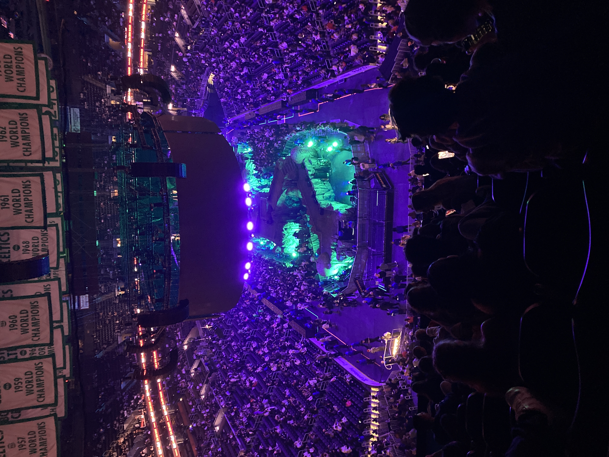
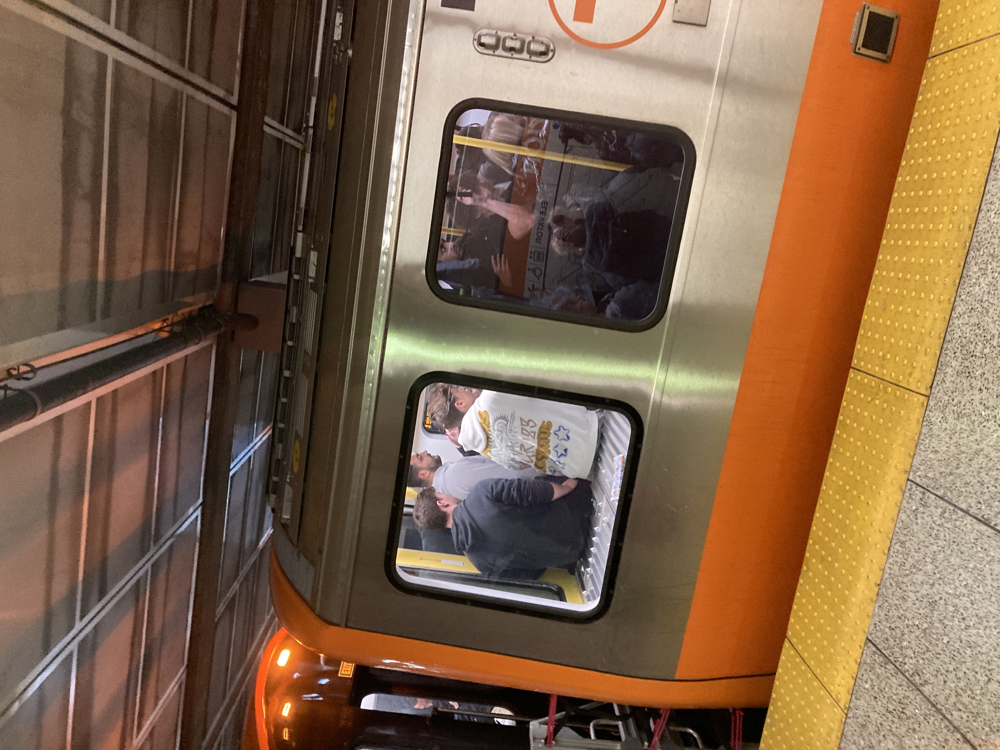

```{r xaringan-themer, include = FALSE, warning = FALSE}
library(xaringanthemer)
style_mono_accent(
  base_color = "#aa0077"
)
```
background-image: url(https://www.billboard.com/wp-content/uploads/2024/07/travis-scott-circus-maximus-2024-billboard-1548.jpg)

```{r setup, include=FALSE}
options(htmltools.dir.version = FALSE)
```

class: inverse, center, middle

# Concerts Are Great

---
class: inverse
background-image: url(./highest_grossing_tour_image.png)
background-size:90% 90%

---
class: inverse, center, middle

# But who else should benefit?

---
class: center, middle

# The cities themselves

---
# What could that refer to?
--

### Namely sources of local income
--

1. Hotels
--


2. Restaurants
--


3. Public Facilities
---
background-image: url(https://upload.wikimedia.org/wikipedia/commons/1/1f/R211_A_train_approaching_80th_Street_August_2025.jpg)
background-size: 100% 100%
class: center, middle, inverse

# Public Transport

---
class: center, middle, inverse

# Some anecdotal experience
---
class: center, middle, inverse



---
class: center, middle, inverse



---
class: center, middle

# This is why I focused on public transport
---
# Stakeholders

--

1. The city that runs the trains

