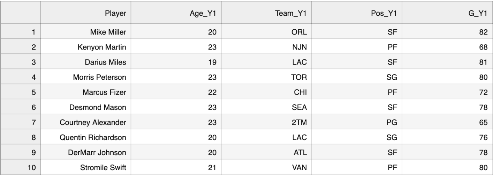
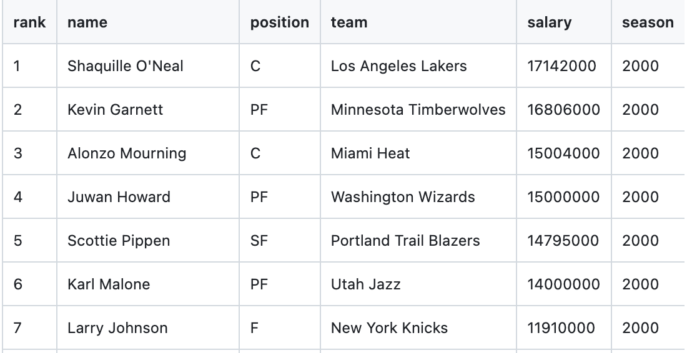
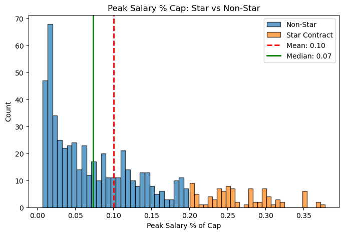
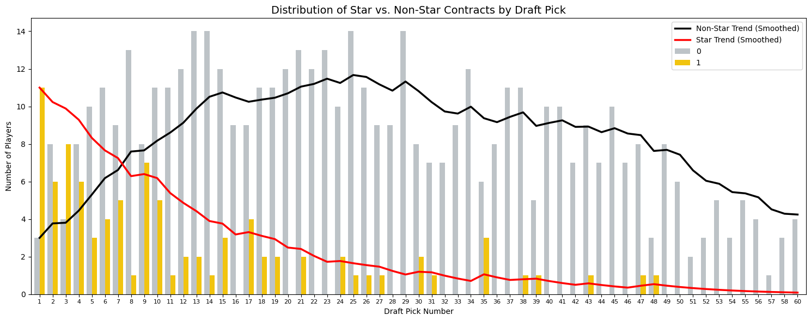
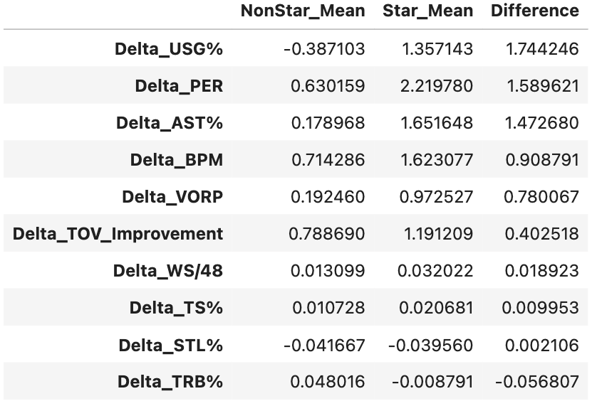
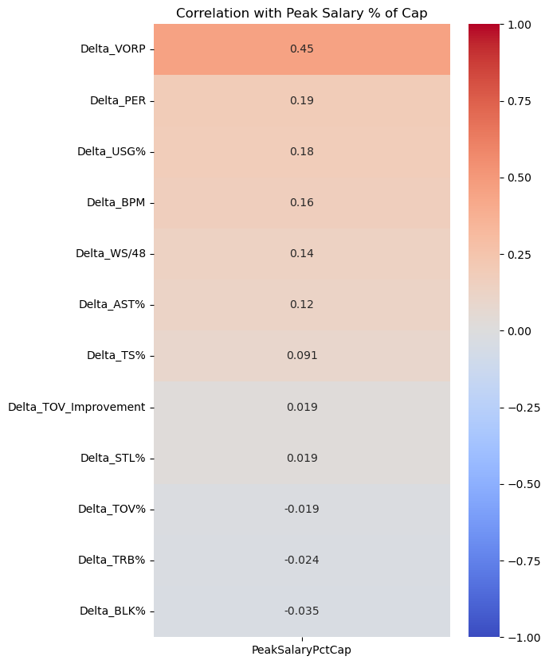

```{r xaringan-themer, include=FALSE, warning=FALSE}
library(xaringanthemer)
style_mono_accent(
  base_color = "#000000",
  header_font_google = google_font("Times New Roman"),
  text_font_google   = google_font("Times New Roman"),
  code_font_google   = google_font("Times New Roman")
)
```

#Research Question: 

###Which early-career improvement factors lead to a "star-level" contract during a player's career?

- **Hundreds of advanced stats and metrics exist to measure different aspects of player performance**

- **Can we use these to predict how high a player's contract value will peak?**

---
# Data





- **Advanced stats scraped from BasketballReference using Gabriel Pastorello's BRScraper tool**

- **Contract data from dataset on GitHub**

- **594 players drafted between 2000 and 2015 were used for this project**

- **Year 1 and Year 2 stats**

- **Advanced stats including TS%, PER, VORP, BPM, WS/48, TRB%, AST%, STL%, BLK%**

---

# Salaries



- **Player salaries represented as % of that season's salary cap to account for cap inflation**

- **Mean: 10% of the salary cap or ~$15.5 million under the current salary cap of $154.64 million**

- **Median: 7% of cap or ~$10.8 million currently**

- **I defined a "star-level" contract as one that is greater than 20% of the salary cap for the given year.**

---

# Expectation vs Reality



- **As expected, the number of players who peaked with a "star contract" is higher at the beginning of the draft**

- **However only picks 1 and 3 have produced more "stars" than non-stars**

---

#Biggest Improvements




---

# Key Advanced Stats

**USG%**: Estimate of the percentage of team plays used by a player while they were on the floor.

**PER**: Measure of per-minute production standardized such that the league average is 15.

**AST%**: Estimate of the percentage of teammate field goals a player assisted while they were on the floor.

**BPM**: Box score estimate of the points per 100 possessions a player contributed above a league-average player, translated to an average team.

**VORP**: Box score estimate of the points per 100 TEAM possessions that a player contributed above a replacement-level (-2.0) player, translated to an average team and prorated to an 82-game season.

**TOV%**: Estimate of turnovers committed per 100 plays. (I used the negative values so an increase would be seen as improvement)

**WS/48**: Estimate of the number of wins contributed by a player per 48 minutes (league average is approximately .100)


.footnote[Definitions from Basketball-Reference.com, "Glossary" and "Advanced Stats". Accessed Feb. 16, 2026.]

---

#Takeaways

- Biggest predictor: improvement in VORP (+0.45 correlation)

- Star-contract players improve most in offensive metrics

- Playmaking improvement matters more than efficiency improvement

- Defensive/rebounding improvements are weak indicators

- Turnover improvement helps, but isn’t a key indicator

---

#Implications for Stakeholders

- **NBA front offices:** early signals for extension decisions and roster planning

- **Agents/players:** highlights which skills most increase long-term earning potential

- **Coaches/player development:** supports targeting growth areas that correlate with star-level pay

- **Fans/media:** provides data-driven context for breakout seasons and contract debates

---
#Ethical/Societal Implications

- **Risk of oversimplifying talent evaluation**
  - Some important traits (leadership, locker room value, injury context) aren’t captured in stats

- **Contract incentives may shift player behavior**
  - Focusing on metrics tied to salary may encourage stat-chasing over team impact

- **Fairness and transparency**
  - Models can improve fairness by reducing subjective bias, but only if used responsibly
  
---

#Future Plans

- Broaden scope to more advanced stats

- Expand time frame to include more NBA, or pre-NBA data

- Build a model 

