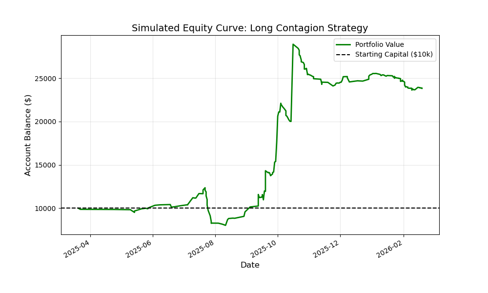

```{r setup, include=FALSE}
options(htmltools.dir.version = FALSE)
library(knitr)
# Global chunk options to automatically hide code and center images
opts_chunk$set(echo = FALSE, fig.align = 'center', out.width = '80%')
```

# Introduction: The Quest for Alpha

**The Modern Market Landscape**
* Traditional financial data (earnings, PE ratios, SEC filings) is instantly priced in by institutional algorithms.
* Generating *Alpha* (excess return) requires finding an edge where others aren't looking.

**The Shift to Alternative Data**
* Satellite imagery, credit card transactions, and web traffic are the new frontiers for hedge funds.
* Goal: Exploit **Information Asymmetry** before the broader market reacts.

**Behavioral Inefficiencies**
* Markets are not perfectly rational. Retail momentum and collective human psychology create measurable, exploitable price distortions.

---

# The Edge in the Echo Chamber

**Why Small Online Forums?**
* Mega-forums (like mainstream news) are heavily monitored by institutional algorithms and often deal with megacap stocks that are unlikely to move much due to punditry.
* Niche retail trading communities serve as incubators for chaotic large scale price shifts ($GME, $BYND, $NBIS).
*Potential market edges may exist but not be scalable meaning large firms responsibly for managing billions or trillions in assets will overlook the ability to make thousands.

**The Hypothesis**
* By aggregating localized, high-conviction retail sentiment, we can front-run retail momentum before it translates into institutional volume.
* **The Challenge:** How do we systematically extract structured financial signals from highly unstructured, chaotic internet slang?

---

# Phase 1: Data Acquisition: Scrapping

**The API Problem**
* The Official Reddit API is heavily rate-limited, expensive, and requires petitioning for a license.

**Scrapping Reddit Trading Communities**
* Built a custom, asynchronous Python scraper to hit raw `.json` endpoints.
* **Rolling-Rate-Limit Evasion:** Implemented a fault-tolerant `immortal_request` function that detects `429 Too Many Requests` errors, sleeps dynamically, and mimics human browser headers to bypass Reddit's firewall allowing the script to be robust against errors, internet outages, and sleeping.
* **Micro-Batching:** Data is saved instantly to local `.csv` files to prevent data loss during long scraping marathons.

**Results**
* We achieve perfect accuracy when scrapping posts, saving the entirety of titles, body text, comment, date, upvotes, and link to our data repository.

---

# Phase 2: The NLP Bottleneck: User Sentiment

**The Failure of Traditional Methods**
* Standard NLP libraries (VADER, finBERT) fail at financial slang. (e.g., "This stock is sick" = Negative to VADER, Positive to retail). And "$CMG to the Moon" is unrecognizable by open access institutional tools like finBERT.
* Regex ticker extraction fails at common words. (e.g., "Sandisk is a strong buy." or "OP is stupid, META is at ATH!").

---

#Phase 2B: The NLP Solution: LLMs

**The Localized LLM Solution**
* Deployed a locally hosted 14-Billion parameter Large Language Model (Qwen 2.5).
* **Why Local?** Zero API costs, absolute privacy, and total control over generation constraints (Only Json).
* The LLM acts as a structured extraction engine, understanding context, detecting sarcasm, and outputting clean JSON `[Ticker, Sentiment]` pairs while aggressively rejecting hallucinations. The 14-Billion parameter model makes less errors then the old traditional sentiment and Regex approach.

**Results**
* Added to our csv: Sentiment classified as "POSITIVE", "NEGAITVE", or "NEUTRAL"
* stock ticker symbol ($META, $TSLA, $APPL)

---

# Phase 3: Financial Grounding

**Calculating Market-Relative Alpha**
* Merging alternative data with empirical market reality using the `yfinance` API.

**The Pipeline**
1. Read the parsed daily signals from the LLM.
2. Query Yahoo Finance for the asset's price on the exact date of the post.
3. Track the asset's trajectory over 1-Day, 1-Week, and 1-Month intervals.
4. **Benchmark:** Subtract the S&P 500 (SPY) return over the exact same period to isolate the stock's true Alpha.

---

# The Initial Backtest: 100% Returns?

**The "Holy Grail" Miracle**
* Initial backtests of a 1-Week holding period on "Positive" consensus stocks yielded localized annualized returns exceeding 100%.

**The Setup**
* Strategy: invest for one week on any ticker with >3 mentions and a positive LLM consensus.
* Accounted for $10,000 starting capital and a strict 0.5% friction/slippage cost per trade.

```{r sal, echo=FALSE, out.width="70%"}

```

*Why did the equity curve look like a straight line up?*

---

# The Reality Check: Statistical Biases

**1. Look-Ahead Bias (The Upvote Problem)**
* *The Error:* Scraping by "Top of the Year" meant sorting by future outcomes. A stock that went bankrupt had 0 upvotes. A stock that soared 500% got upvoted *after* the fact. 
* *The Fix:* Forcing the pipeline to scrape strictly chronologically by "New."
* Originally, we wanted easy access to historical Reddit posts which is why we shied away from "New". Reddit only saves 1000 posts by each tab.

**2. Survivorship Bias (The Bankruptcy Problem)**
* *The Error:* Yahoo Finance purges delisted/bankrupt companies. The backtest silently dropped these `-100%` losses, artificially inflating the win rate of the "survivors."
* *The Fix:* Engineered a "Lock-Box" memory system that explicitly penalizes the portfolio with total losses if a tracked ticker disappears from the exchange. Tracking in real-time allows us to track when and if these stocks go bankrupt.
---

# Future Architecture & Forward-Testing

**Scaling the Operation**
* Transitioning from historical backfilling to a lightweight, daily Scrape job handled by Windows Task Scheduler.
* Processing strictly chronological, 48-hour data windows to guarantee zero look-ahead bias.

**Live Forward-Testing (The Ultimate Proof)**
* Historical backtests are inherently flawed. 
* **Next Step:** Connecting the output of the Alpha pipeline to the **Alpaca Trading API**.
* Deploying a "Paper Trading" bot to execute these momentum signals live with fake capital, measuring actual market slippage and real-time execution dynamics before risking a single dollar.

---

class: center, middle

# Thank You

**Questions?**
