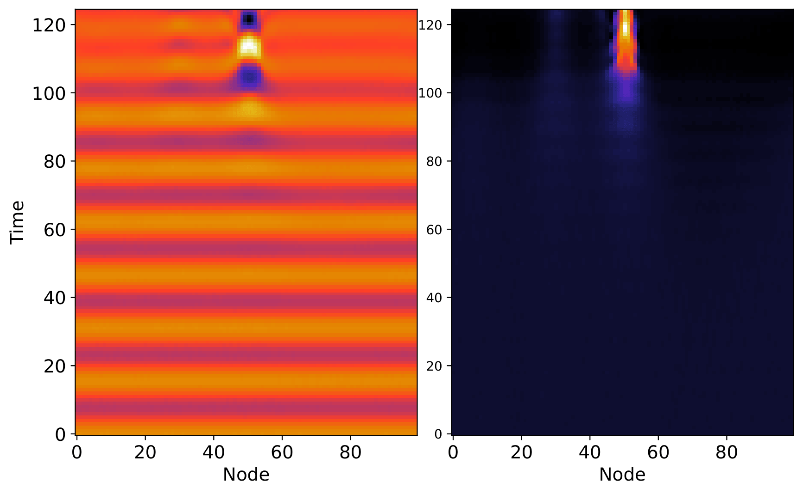
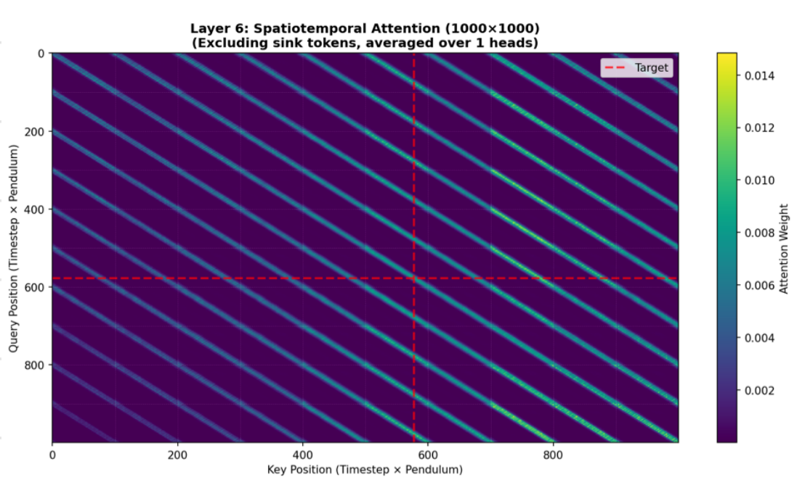
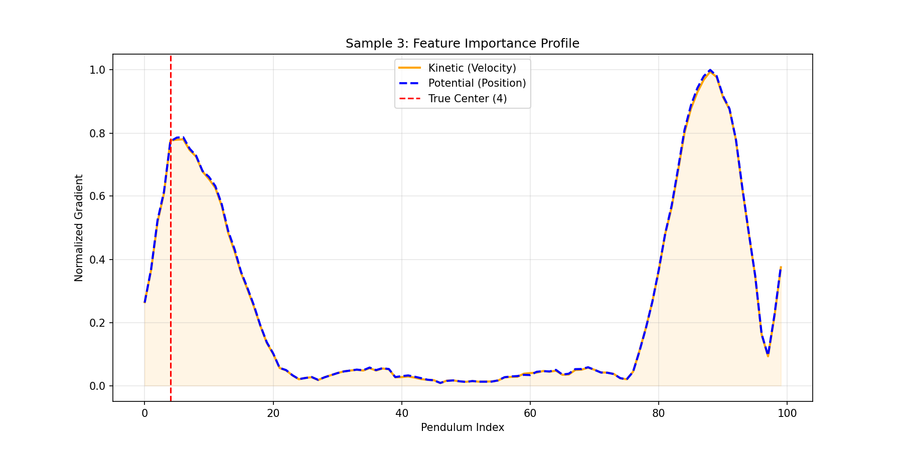

```{r setup, include=FALSE}
options(htmltools.dir.version = FALSE)
library(knitr)
# Global chunk options to automatically hide code and center images
opts_chunk$set(echo = FALSE, fig.align = 'center', out.width = '80%')
```

# Background
### Sine-Gordon: 100 Coupled Pendula

Here is a visual representation of the chaotic system dynamics we are modeling.

<iframe width="100%" height="450" src="https://www.youtube.com/embed/1-BOMA5wk78" title="YouTube video player" frameborder="0" allow="accelerometer; autoplay; clipboard-write; encrypted-media; gyroscope; picture-in-picture" allowfullscreen></iframe>

---

# Tractable Data & Data Retrieval
### Simulating 100k Datasets

Our system can be modeled with the Sine-Gordon Differential Equation with an added global coupling term. Given a random set of initial conditions (pendula angle) we can simulate how the system evolves in time in discrete steps eventually leading to localization. We can then save the first ten time steps for training and a label to go with it stating which of the 100 pendulums localization occurred at.

```{r colormap, echo=FALSE, out.width="70%"}

```
---

# The Model
### Transformer Architecture

Why use a Transformer?

* Easily interpretable compared to old LSTM-CNN model.
* Can handle temporal and geometric spatial data simultaneously. 

---

# Performance & Percision
### Is it chaotic: Sensitivity to initial Conditions

Our modified Sine-Gordon system is said to be chaotic however results from the attention indicating nearest neighbors are most important hold this claim in tension. Is localization really chaotic or only the instability to reach that point? Features are on the scale of 0.1-1. What happens if we limit precision in our data how is accuracy affected?

| Precision Level | Accuracy | +/- 1 Accuracy |
| :---            | :---:    | :---:          |
| **FULL** | 75.03%     | 97.02%           |
| **1 Decimal** | 12.95%     | 33.56%           |
| **2 Decimal** | 49.22%     | 85.15%           |
| **3 Decimal** | 67.42%     | 94.73%           |
| **5 Decimal** | 67.81%     | 95.22%           |

---

# Attention 
### What is the Model Looking At?

The self-attention mechanism tells us for a given pendulum which others inform its label the most? In other words what is the model paying to most attention to when deciding.

```{r Att, echo=FALSE, out.width="70%"}

```

---

# Saliency Map
### Visualizing Feature Importance

Saliency Maps answer the question which features, when changed, result in the greatest shift in model prediction.

```{r sal, echo=FALSE, out.width="70%"}

```

---

# Implications for Stakeholders
### Who Benefits?

Who benefits from machine learning informed physics?

1. **Physics Researchers!:** We gain the ability to gain physical insight from complex nonlinear systems without relying on traditional methods or breakthroughs in fundamental mathematics. This is a type of advanced numerical modeling that can accelerate research.
2. **Engineers:** They can quickly stress test weaknesses in complex dynamical systems and approximate potential causes for catastrophic failure.

---

# Societal Implications
### Scaling the Impact

Scaling this up: why predicting chaos matters.

* **Broader ML Context:** Proving transformers can learn physics directly from data.
* **Real-world Applications:** Ranging from weather forecasting to structural engineering under stress.

<iframe width="100%" height="450" src="https://www.youtube.com/embed/XggxeuFDaDU?start=48" title="YouTube video player" frameborder="0" allow="accelerometer; autoplay; clipboard-write; encrypted-media; gyroscope; picture-in-picture" allowfullscreen></iframe>

---

class: center, middle

# Thank You

### Questions?
