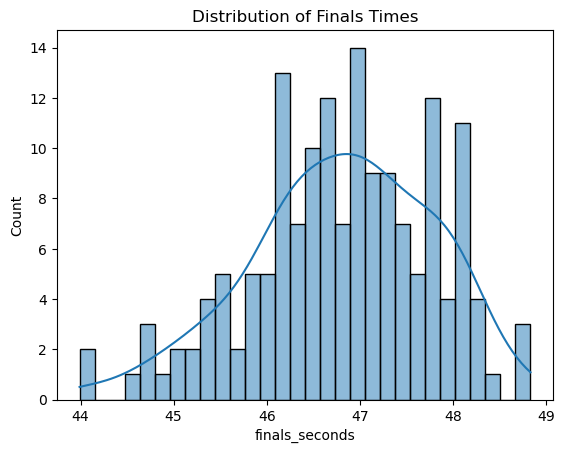
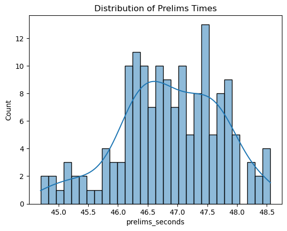
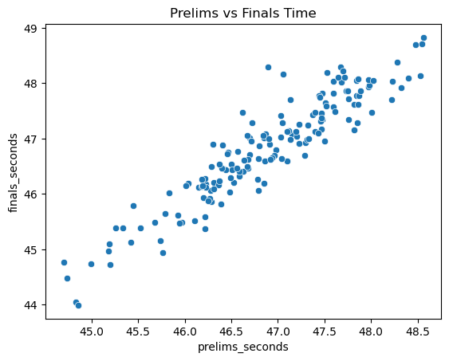
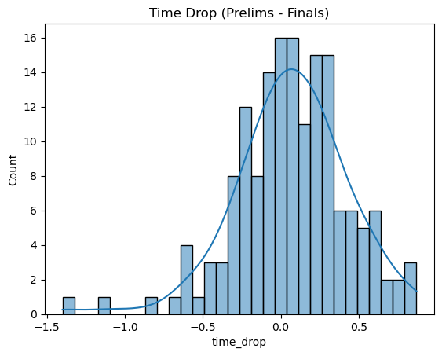
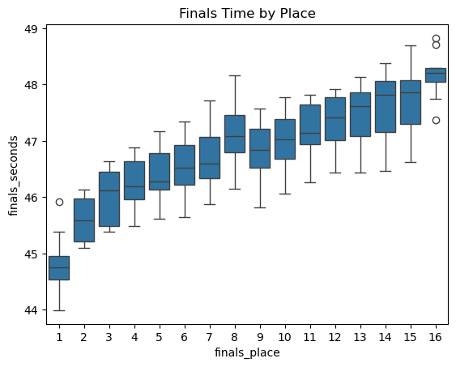
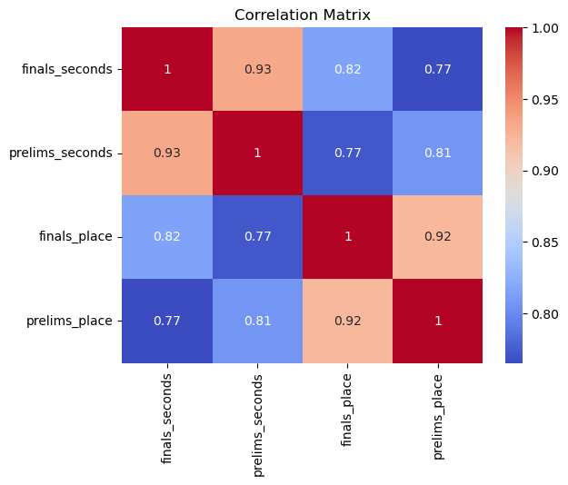
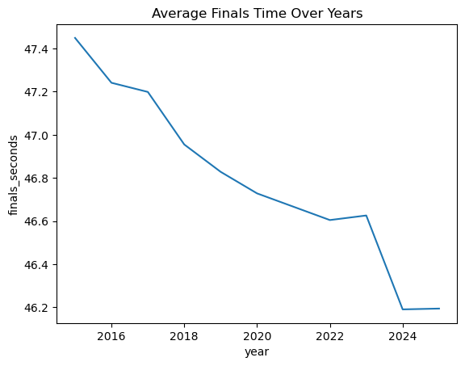

```{r setup, include=FALSE}
options(htmltools.dir.version = FALSE)
knitr::opts_chunk$set(
  echo = FALSE,
  message = FALSE,
  warning = FALSE
)
```

```{css, echo=FALSE}
/* ── Custom theme overrides ── */
.remark-slide-content {
  background-color: #f8f9fa;
  font-family: 'Source Sans Pro', sans-serif;
}

.remark-slide-content h1 {
  color: #065A82;
  font-size: 2rem;
  border-bottom: 3px solid #02C39A;
  padding-bottom: 0.3rem;
}

.remark-slide-content h2 {
  color: #1C7293;
  font-size: 1.5rem;
}

/* Title slide */
.title-slide {
  background-color: #065A82;
  color: #ffffff;
}
.title-slide h1 { color: #02C39A; border-bottom: none; font-size: 2.4rem; }
.title-slide h2 { color: #CADCFC; font-size: 1.3rem; }
.title-slide .author { color: #ffffff; font-size: 1.1rem; }
.title-slide .date   { color: #CADCFC; font-size: 0.95rem; }

/* Accent / highlight boxes */
.highlight-box {
  background-color: #065A82;
  color: #ffffff;
  border-radius: 8px;
  padding: 0.8rem 1.2rem;
  margin: 0.5rem 0;
}

.teal-box {
  background-color: #02C39A;
  color: #021626;
  border-radius: 8px;
  padding: 0.8rem 1.2rem;
  margin: 0.5rem 0;
  font-weight: 600;
}

/* Two-column layout helpers */
.left-col  { float: left;  width: 48%; }
.right-col { float: right; width: 48%; }
.clear     { clear: both; }

/* Step boxes */
.step {
  background-color: #1C7293;
  color: #ffffff;
  border-radius: 6px;
  padding: 0.6rem 1rem;
  margin-bottom: 0.5rem;
  font-size: 0.95rem;
}

/* Footnote / caption style */
.footnote-custom {
  font-size: 0.78rem;
  color: #6c757d;
  border-top: 1px solid #dee2e6;
  padding-top: 0.4rem;
  margin-top: 1rem;
}

/* Big stat callout */
.big-stat {
  font-size: 3rem;
  font-weight: 700;
  color: #065A82;
  line-height: 1.1;
}
.big-stat-label {
  font-size: 0.9rem;
  color: #6c757d;
  text-transform: uppercase;
  letter-spacing: 0.05em;
}
```


# What Is a Conference Championship?

.left-col[
Conference championships are the **culmination of an entire swim season** — every practice, dual meet, and taper leads to this one weekend.

**How scoring works:**
- All conference teams compete together
- Swimmers must **qualify for finals** through preliminary heats
- Points are awarded based on **finish place in the finals**
- The team with the most total points wins the conference title
]

.right-col[
.highlight-box[
🏊 **Prelims** — Swim to qualify for finals. Your seed time and in-meet swim determine if you advance.
]

.highlight-box[
🥇 **Finals** — The top finishers score points for their team. Place 1st–16th (varies by conference) for team points.
]

.teal-box[
Knowing what **time you need** to qualify or medal is the central question every coach faces during lineup construction.
]
]

.clear[]

---

# SwimCloud: Our Data Source

.left-col[
[SwimCloud](https://www.swimcloud.com) is a comprehensive platform hosting **meet results for every NCAA swim program and conference**.

**What's available:**
- Full meet results for every conference championship, going back multiple years
- Individual swimmer times, events, and splits
- Team rosters updated regularly
- Every NCAA conference (D1, D2, D3)
]

.right-col[
.teal-box[
**Why SwimCloud?**

It is the single most complete, publicly accessible repository of collegiate swimming data — no manual data collection needed.
]

<br>

.highlight-box[
**Scraping Strategy**

We systematically pull historical conference championship results across all conferences and years to build our regression training dataset.
]
]

.clear[]

.footnote-custom[
Data sourced via structured web scraping. All usage complies with publicly accessible content.
]

---

# Project Architecture

<div class="highlight-box" style="text-align:center;">
SwimCloud Historical Data
</div>

<div style="text-align:center; font-size: 2rem; color:#1C7293;">↓</div>

<div class="step" style="text-align:center;">
<b>Web Scraper</b><br>
Collect all conference championship results
</div>

<div style="text-align:center; font-size: 2rem; color:#1C7293;">↓</div>

<div class="step" style="text-align:center;">
<b>Regression Models</b><br>
Predict qualifying and medal times by place and event
</div>

<div class="left-col">
<div class="step" style="text-align:center;">
<b>Streamlit Dashboard</b>
</div>
</div>

<div class="right-col">
<div class="step" style="text-align:center;">
<b>Live Roster Scrape</b><br>
Coach inputs team URL
</div>
</div>

<div class="clear"></div>

<div style="text-align:center; font-size: 2rem; color:#1C7293;">↓</div>

<div class="highlight-box" style="text-align:center;">
<b>Linear Programming</b><br>
Optimal lineup using regression predictions
</div>

---

# Regression: Predicting Future Times

.left-col[
**Goal:** For each event and place (e.g., *200 Free, 8th place*), predict the **winning time** in upcoming conference championships.

**Features under consideration:**
- Historical times by place (multi-year trend)
- Conference (performance level varies significantly)
- Event type (sprint vs. distance)
- Year-over-year improvement rates
]

.right-col[
.highlight-box[
**Why Regression?**

Conference championship cutoff times follow relatively **predictable trends** year-over-year. Regression lets us quantify that trend and project it forward with confidence intervals.
]

<br>

.teal-box[
**Output per model:**  
Estimated time to **qualify for finals** and estimated time to **place in top 8 (score)** for every event × conference combination.
]
]

.clear[]

---

# Linear Programming: Lineup Optimization

.left-col[
Given the regression output, coaches need to know: **"How do I enter my roster to maximize team points?"**

**Constraints:**
- NCAA rules limit entries per swimmer (e.g., max 3 individual events + relays)
- Each event has a limited number of relay spots
- A swimmer can only swim an event once
- Entries must be submitted before the meet

**Objective:**
- Maximize projected team points across all events
]

.right-col[
.step[**Step 1** — Coach inputs their team's SwimCloud profile URL]

.step[**Step 2** — Live scraper pulls current roster & best times]

.step[**Step 3** — Regression model estimates projected finish places]

.step[**Step 4** — LP solver finds the optimal event assignment]

.step[**Step 5** — Dashboard returns the recommended lineup + projected points]
]

.clear[]

---

# Streamlit Dashboard

.left-col[
Coaches interact with the tool through a **Streamlit web app** — no coding required.

**Workflow:**
1. Paste a SwimCloud team URL
2. Live scrape pulls the current roster and best times automatically
3. Results are passed through the regression + LP pipeline
4. The dashboard returns a recommended lineup table and projected point total
]

.right-col[
.teal-box[
**Recruiting Use Case**

Beyond lineup planning, coaches can explore *where their roster is thin* — which events they are projected to score zero points in — and use that gap analysis to guide **targeted recruiting**.
]

<br>

.highlight-box[
**Live Scraping**

Roster data is pulled fresh every session, so the tool always reflects the team's current swimmers and most recent personal bests.
]
]

.clear[]

---

# Current Progress

.left-col[
### ✅ In Progress

.step[Historical conference championship scraper — pulling multi-year results from SwimCloud across all NCAA conferences]

.step[Live roster scraper — given any team URL, extract current swimmer names, events, and best times]
]

.right-col[
### 🔜 Up Next

.highlight-box[
**Regression modeling** — once the historical dataset is assembled, we will fit and validate predictive models per event × conference
]

.highlight-box[
**LP formulation** — define the optimization constraints and objective function in Python (likely using `PuLP` or `scipy.optimize`)
]

.highlight-box[
**Streamlit UI** — tie the pipeline together into a deployable dashboard
]
]

.clear[]

---

# Who Benefits?

<br>

.left-col[

## 🏊 **College Swim Coaches**

The **primary user**. Coaches can generate an optimized conference lineup in minutes instead of manually analyzing spreadsheets.

]

.right-col[

## 📋 **Recruiting Strategy**

Coaches can identify **point gaps** in their roster — events where no current swimmer is projected to score — and direct recruiting efforts to fill those gaps strategically.

]

.clear[]

<br>

.teal-box[
**Bottom line:** This tool transforms publicly available data into a competitive advantage — enabling any NCAA swim program, regardless of size or resources, to make smarter lineup and recruiting decisions.
]


---
class: inverse, center, middle

# Event-Specific EDA

## Centennial Conference Men’s 100 Yard Freestyle (2015–2025)

---

# Dataset Snapshot

.left-col[
### Scope
- **Single event focus:** Men’s 100 Yard Freestyle
- **10 championship seasons:** 2015–2020, 2022–2025
- **160 observations total**
- **Top 16 swimmers per year**

### Variables used
- year
- swimmer / team
- prelims place & time
- finals place & time
- score
]

.right-col[
.teal-box[
**Why isolate one event first?**

Before scaling to every event, we wanted to test whether one event shows a stable enough structure for prediction. The 100 free is useful because it is contested every year, has a deep field, and typically has very small time margins.
]

.highlight-box[
**Data quality result**

The notebook showed **no missing values** across any of the 10 columns, so the event-level file was clean enough for immediate exploratory analysis.
]
]

.clear[]

---

# Overall Performance Distribution

.left-col[

]

.right-col[

]

.clear[]

.teal-box[
Across all 160 swims, the distributions of prelim and final times are tightly concentrated in the **mid-46 to high-47 second range**, which suggests a relatively stable competitive band across years.
]

.highlight-box[
**Key summary stats**

- Mean finals time: **46.80 s**
- Mean prelim time: **46.87 s**
- Average improvement from prelims to finals: **0.066 s faster** in finals
]

---

# Prelims Are Highly Predictive of Finals

.left-col[

]

.right-col[
<div class="highlight-box">
The strongest pattern in the EDA is a very clear linear relationship between a swimmer's prelim time and finals time.
</div>

<div class="teal-box">
**Correlation:** prelim seconds vs finals seconds = **0.93**
</div>

### Interpretation
- Faster prelim swimmers are usually faster again at night
- The relationship is tight enough to justify regression as a forecasting tool
- This supports the larger project goal of predicting likely scoring times from historical performance patterns
]

.clear[]

---

# How Much Do Swimmers Improve at Finals?

.left-col[

]

.right-col[
The time-drop distribution is centered just above zero, meaning that **most swimmers improve slightly from prelims to finals**, but the change is usually modest.

### What this tells us
- Big time drops are the exception, not the rule
- Finals performance is usually an incremental improvement rather than a total reshuffling of the field
- A prediction model should expect **small but meaningful** movement from morning to night

.highlight-box[
A few negative outliers appear, so not everyone gets faster in finals. That variability matters when building uncertainty into forecasts.
]
]

.clear[]

---

# Placement Structure Is Also Stable

.left-col[

]

.right-col[

]

.clear[]

.teal-box[
Finals times rise steadily as placement gets worse, which means the event has a clean place-to-time ordering rather than heavy overlap across the entire field.
]

### Correlation takeaways
- finals place vs prelims place: **0.92**
- finals seconds vs finals place: **0.82**
- prelims seconds vs prelims place: **0.81**

This suggests that seeding position and finishing position are closely connected, which is encouraging for any model trying to convert raw times into projected scoring outcomes.

---

# The Event Has Gotten Faster Over Time

.left-col[

]

.right-col[
The average finals time trends downward across the decade, from the **mid-47s in 2015** to roughly the **low-46s by 2024–2025**.

.highlight-box[
That means the field has improved by roughly **1.2 to 1.3 seconds** over the sample period.
]

### Why this matters
- Historical performance is **not static**
- A simple average of all past years would ignore event-level improvement
- Our regression stage should account for **time trend / year effect** so that projected cutoffs reflect the modern speed of the conference
]

.clear[]

---

# Why This EDA Matters for the Full Project

.left-col[
### Main findings from this portion
1. The event-level data is clean and consistent
2. Prelims are a strong predictor of finals
3. Most swimmers improve only slightly at night
4. Place ordering is stable across the top 16
5. The conference has become faster over time
]

.right-col[
.teal-box[
**Modeling implication**

For the optimizer, we should not treat conference results as random. In this event, the historical structure is regular enough that it should support predictive modeling of scoring thresholds.
]

.highlight-box[
**Practical coaching implication**

If a coach knows roughly what a swimmer can go in prelims, this historical structure gives a reasonable way to estimate where that swimmer is likely to land in finals and whether they can score.
]
]

.clear[]

---
class: center, middle
background-color: #065A82

# Thank You

.white[
**Ben Brandt & Andrew Kelley**  
DATA 400 — Final Project Checkpoint

Questions? Comments?
]

<br>

.teal-box[
Next steps: Complete data collection → Model training → Dashboard prototype
]
